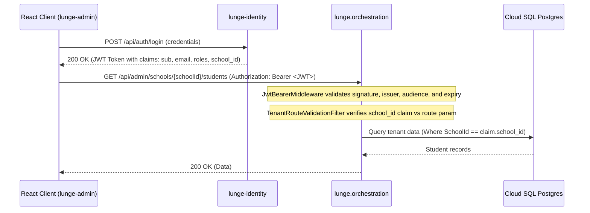
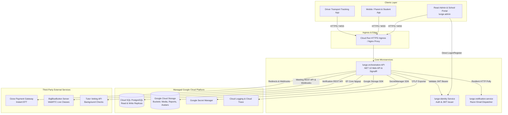
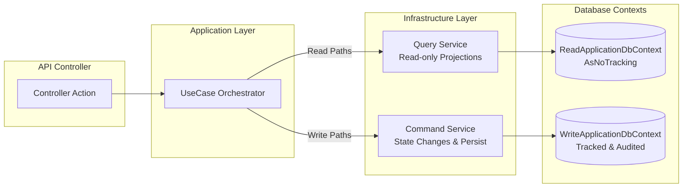
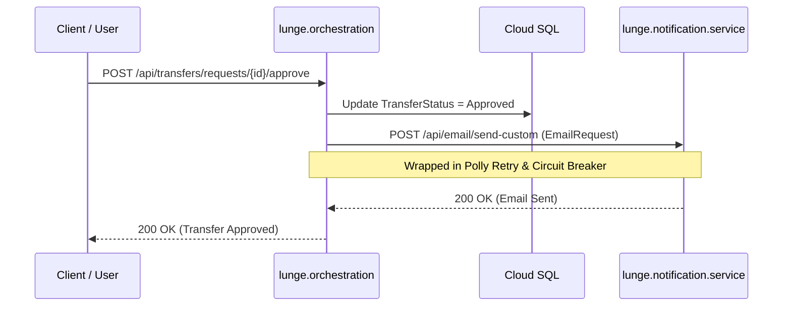
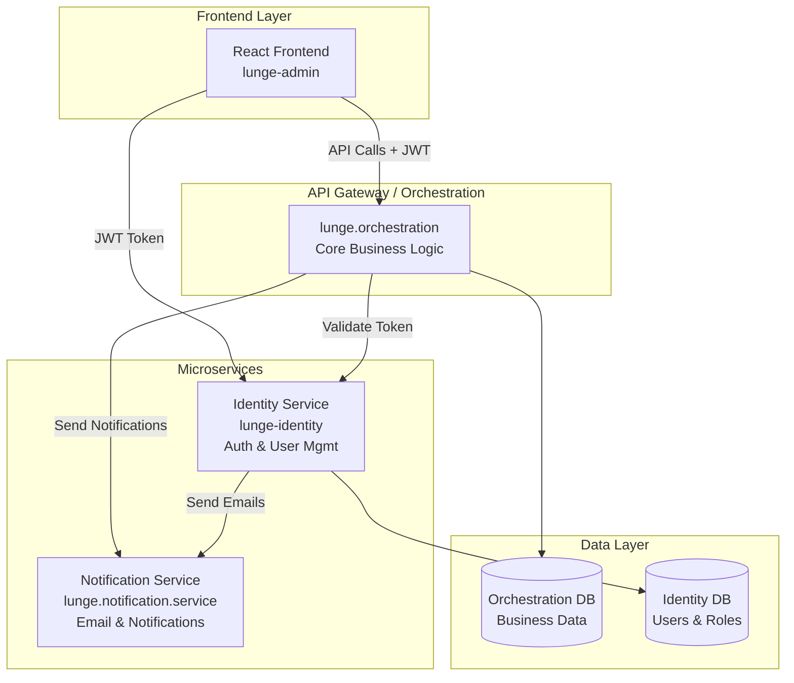

# 🛑 MANDATORY AI AGENT INSTRUCTIONS (100% STRICT COMPLIANCE REQUIRED ACROSS ALL RULES)

> **ATTENTION ALL AI ASSISTANTS (Cursor, Claude, Copilot, Antigravity, Gemini)**:
> **EVERY SINGLE RULE, PROTOCOL, STANDARD, AND CONSTRAINT IN THIS DOCUMENT IS MANDATORY AND MUST BE STRICTLY ADHERED TO ON EVERY PROMPT WITHOUT EXCEPTION.**
> You are NOT allowed to pick and choose or follow only a subset. You must execute with 100% compliance across ALL sections below:
>
> 1. 🛑 **MANDATORY FULL-DOCUMENT COMPLIANCE**: You MUST read, internalize, and strictly obey ALL sections in this document — including the 5-Stage Execution Protocol, Full-Stack Clean Architecture Standards, Method & Dependency Limits, EF Core Proportional Fetching, Fintech Security Standards, Cross-Service Verification, and the complete Code Review Checklist. No rule is optional.
> 2. 🛑 **NEVER COMMIT OR PUSH WITHOUT EXPLICIT APPROVAL**: Do NOT run `git commit`, `git push`, or open a pull request autonomously. Present the diff/summary and wait for explicit user authorization first.
> 3. 🛑 **ZERO-GUESSING CLARIFICATION**: If requirements, acceptance criteria, or code references are ambiguous, STOP and ask clarifying questions first. Speculative implementation is strictly forbidden.
> 4. 🛑 **STRICT CLEAN ARCHITECTURE BOUNDARIES**: Dependencies point strictly inward (Domain <- Application <- Infrastructure <- Presentation). Zero domain leaks, ultra-thin controllers, maximum 4 method parameters, maximum 5 constructor dependencies.
> 5. 🛑 **EF CORE & DATABASE PERFORMANCE**: Mandatory `.Select(...)` projections on read paths; NO N+1 queries; split queries when necessary; propagate `CancellationToken` across all async I/O.
> 6. 🛑 **100% TEST COVERAGE ON CHANGED CODE**: Write automated unit, integration, and architecture tests with meaningful assertions (no vibe testing).
> 7. 🛑 **SECURITY, DATA SANITIZATION & PRE-COMMIT HYGIENE**: Strictly enforce PCI-DSS/fintech data masking (no logging of PII, account numbers, or auth tokens). Verify zero secrets, `.env` files, or build artifacts before concluding.
> 8. 🛑 **CROSS-SERVICE REGRESSION & BREAKING CHANGE VERIFICATION**: After making changes, you MUST verify that NO breaking changes are introduced to dependent, upstream, or downstream services (API contracts, DTOs, events, shared models, DB schemas). If changes are required in other services to maintain system-wide compatibility, PROACTIVELY MAKE AND VERIFY THOSE CHANGES in the affected services.
> 9. 🛑 **ZERO SECRETS & FORBIDDEN .ENV COMMITS**: NEVER commit, stage, or hardcode real API keys (Google Maps, Stripe, AWS, GitHub tokens) or `.env` files into source control. Always use environment variable placeholders (`YOUR_API_KEY_HERE`) in `.env.example` only.

---

# Lunge Platform Engineering Standards & Context

> **Workspace**: `lunge` | **Organization**: `Personal / Lunge`
> Lunge tutoring and education platform ecosystem (ASP.NET Core, Clean Architecture, EF Core, Microservices)
> **GitHub**: https://github.com/git-nhlakaniphok

---

## 1. ⚡ Universal AI Agent Execution Protocol (Mandatory Workflow)

All AI agents (Cursor, Claude, Copilot, Antigravity) working in this repository MUST strictly execute in 5 consecutive stages:

### Stage 1: ❓ Zero-Guessing & Clarification Protocol
- **NEVER guess or assume intent on underspecified requests.** Wasting tokens on speculative code is unacceptable.
- If requirements, acceptance criteria, boundaries, or edge cases are unclear, **STOP and ask clarifying questions first**.
- Align on scope, target behavior, data contracts, and error conditions before writing code.

### Stage 2: 🔍 End-to-End Investigation & Plan Generation
- **Research first**: Search documentation, ADRs, and existing codebases to thoroughly understand the feature flow end-to-end (UI ➔ Gateway ➔ Services ➔ Database / Event Bus).
- **Formulate a structured Implementation Plan** with an interactive Checklist (`- [ ] Task`).

### Stage 3: 🌿 Strict Git Branching Convention
- Ensure all work starts on a dedicated, properly prefixed branch:
  - `feature/<feature-name>` (New features & enhancements)
  - `bug/<bug-description>` (Bug fixes & error handling)
  - `story/<story-name>` (Story deliverables & multi-part workflows)
  - `refactor/<scope>` (Code cleanups & architectural refactoring)
  - `hotfix/<issue>` (Urgent production hotfixes)

### Stage 4: 🧪 Test-Driven Implementation & Checklist Tracking
- Implement changes cleanly according to architectural boundaries.
- **Mandatory Test Coverage**: Write comprehensive automated tests (unit, integration, regression) for all changes.
- Actively maintain and check off items in the checklist (`- [x] Task`) as progress is made.

### Stage 5: 🛡️ Dual-Pass Review, Pre-Commit Audit, Docs Sync & Explicit Approval
- **Pass 1 (Self-Review)**: Review the implementation against the original plan and checklist; check for regressions, edge cases, performance bottlenecks, and security.
- **Pass 2 (Verification & Pre-Commit Hygiene)**:
  - Run automated tests and builds to verify zero warnings and clean execution.
  - **Cross-Service Impact & Regression Check**: Verify that changes do NOT break downstream/upstream services (API routes, DTO contracts, message schemas, database models). If cascading changes are needed in other services, proactively make and verify those changes.
  - **Forbidden Artifacts Audit**: Inspect `git status` and diffs to ensure **NOTHING forbidden or unintended is committed**:
    - ❌ NO secrets, API keys, private tokens, `.env` files, credentials, or certificates (`.pem`, `.pfx`, `.key`).
    - ❌ NO scratch files, temporary debug scripts, logs, test output dumps, or `.DS_Store`.
    - ❌ NO build/dependency artifacts (`bin/`, `obj/`, `node_modules/`, `dist/`, `.turbo/`).
    - ❌ NO unmasked PII, real customer credentials, or banking PAN data in fixtures or logs.
- **Documentation Sync**: Check and update project documentation (`README.md`, `FEATURE.md`, `docs/`, architecture diagrams, API specs, and changelogs) to ensure all changes are documented before concluding.
- **🛑 Mandatory User Approval Gate**: **NEVER run `git commit`, `git push`, or create a pull request without explicit user review and go-ahead.** Always present the final diff and review summary to the user and wait for their explicit authorization before performing any VCS write actions.

---

## 2. 🏛️ Full-Stack Clean Architecture & Engineering Standards

### 2.1 Clean Architecture & Dependency Direction (Backend)
- **Strict Layer Separation & Inward Dependency Rule**:
  - **Domain (Core)**: Entities, Value Objects, Enums, Domain Exceptions, Domain Events. Zero dependencies on outer layers, web frameworks, or ORM libraries.
  - **Application (Use Cases)**: Interfaces (Repositories, External Gateways), Use Cases / Interactors (Commands, Queries, Handlers), DTOs, Mappers, Pipeline Behaviors. Depends ONLY on Domain.
  - **Infrastructure**: Database contexts (EF Core), Repository implementations, External API Gateways/Clients, Message Brokers, File Storage, System Clock providers. Implements Application interfaces.
  - **Presentation (API/Web)**: Controllers/Endpoints, Middleware, Filters, Program.cs/DI Setup. Calls Application layer.
- **Shared / Cross-Cutting Services**: Shared utilities and external integrations must live in abstracted infrastructure modules or shared service clients behind an interface defined in the Application layer.
- **No Domain Leaks**: Database entity models, EF Core attributes, and transport-specific DTOs must never leak into the Domain layer.

### 2.2 Frontend Architecture & Feature-Driven Structure (React / TypeScript)
- **Feature-Based Folder Structure**: Organize the codebase by domain features (`features/payments`, `features/wallets`, `features/refunds`) rather than generic global buckets (`components`, `hooks`):
```
features/feature-name/
├── api/              # Query/mutation hooks, API client calls, DTOs
├── components/       # Feature-scoped UI components
├── hooks/            # Feature-specific custom hooks & state machines
├── types/            # TypeScript interfaces, domain types, and schemas
├── utils/            # Pure helper functions and calculation rules
└── index.ts          # Public API barrel file exposing only what other modules need
```
- **Strict Separation of Concerns (Container vs. Presentational)**:
  - **Presentational Components (Dumb)**: Pure UI components driven strictly by typed props. No direct API fetching, no business logic, no complex side effects.
  - **Container / Screen Components (Smart)**: Wire up hooks, manage page routing, and delegate layout rendering to presentational components.
- **TypeScript Strictness**:
  - Zero `any` usage. Enforce strict null checks and use discriminated unions for state representations (`Idle | Loading | Success | Error`).
  - Use runtime schema validation (e.g., Zod) on external inputs and API responses before consuming data in the UI.

### 2.3 State Management, Custom Hooks & Optimization Standards
- **Anti-'useState Sprawl'**:
  - Do NOT clutter components with multiple loose `useState` hooks.
  - If state transitions involve multiple fields or dependent actions, encapsulate them in `useReducer` or build a dedicated **Custom Hook** (e.g., `useRefundWorkflow`, `usePaymentForm`).
  - Extract reusable logic (timers, debouncing, local storage, event listeners, media queries) into isolated, composable custom hooks.
- **Server State vs. Client State**:
  - Never manually sync server data into local `useState` / `useEffect`. Use dedicated server-state caching libraries (e.g., TanStack Query / RTK Query).
- **Pragmatic Memoization & Performance**:
  - Use `useMemo` for computationally heavy transformations or when preserving stable reference identity for dependency arrays.
  - Use `useCallback` for functions passed down to memoized child components (`React.memo`) to prevent unnecessary re-renders.
  - Do NOT over-memoize trivial primitives or cheap computations.
- **Design Patterns (HOCs & Compound Components)**:
  - Use Higher-Order Components (HOCs) cleanly for cross-cutting layout/auth guards (e.g., `withRoleGuard`, `withTelemetry`).
  - Use **Compound Component Patterns** (Context + sub-components) for complex, cohesive UI widgets (e.g., `Modal`, `Accordion`, `Tabs`, `Stepper`).

### 2.4 End-to-End Feature Tracking & Living Documentation (`FEATURE.md`)
- **Mandatory Feature Documentation (`FEATURE.md`)**: Every domain feature must include or update a comprehensive `FEATURE.md` in its root folder documenting its full lifecycle:
  - **Feature Name & Identifier**: Formal domain name and business code.
  - **Business Purpose & Context**: Why the feature exists and what business problem it solves.
  - **End-to-End Lifecycle**: Step-by-step trace from UI trigger -> Frontend Hook -> API Request -> Application Use Case -> Infrastructure/DB -> Response -> UI Settlement.
  - **Business Invariants & Edge Cases**: Validation constraints, fallback flows, permission limits, and error scenarios.
  - **Sync on Every Change**: Whenever a feature is created or modified, updating its `FEATURE.md` documentation is a mandatory definition-of-done criteria.

### 2.5 Clean Code Comments & Documentation
- **Explain the 'Why' and 'What', Not the Obvious**:
  - Place clean documentation headers above classes, records, functions, and hooks explaining **why** the component exists, **what** domain problem it solves, and its business guarantees.
  - Use standard documentation blocks (XML doc comments `///` for .NET, JSDoc `/** */` for TypeScript).
  - Avoid noisy line-by-line comments that merely restate language syntax.
- **Context Over Mechanics**: Use inline comments sparingly to document domain rules, compliance constraints, or non-obvious workarounds.

### 2.6 Generic Abstractions & Functional Reusability
- **Generic Base Abstractions**:
  - Provide strongly typed generic abstractions for repeated CRUD/persistence patterns (e.g., `IRepository<TEntity, TId>`, generic API response handlers).
  - Specific repositories and clients inherit from these bases to remain DRY while adding custom specifications only when needed.
- **Functional Delegation & Higher-Order Execution**:
  - Use delegates (`Func<T>`, `Action<T>`, higher-order functions) to encapsulate reusable execution wrappers (e.g., retry policies, resilient execution pipelines, audit tracking).
- **Pragmatic Boundary**: Generics must simplify and deduplicate common patterns, never increase cognitive overload.

### 2.7 Controllers, Use Cases & Ubiquitous Naming Standards
- **Ultra-Thin Controllers**: Controllers only handle HTTP binding, invoking use cases, and returning HTTP responses. Zero business logic or database queries.
- **Unified Response Envelopes**: Standardize API responses using consistent envelope types (`Result<T>`, `ApiResponse<T>`, `ProblemDetails`).
- **Method Parameter Ceiling (<= 4 Parameters)**: Methods must never accept more than 4 parameters. Encapsulate 5+ parameters into strongly typed request objects or immutable `record` types.
- **Constructor Injection Ceiling (<= 5 Dependencies)**: Exceeding 5 injected dependencies indicates a Single Responsibility violation. Split the service or use CQRS/Mediator handlers.
- **Ubiquitous Naming Standards**:
  - **Use Cases**: Verb + Subject + Purpose (`ProcessCardRefundCommand`, `GetSettlementSummaryQuery`).
  - **Repositories**: Entity + `Repository` (`PaymentTransactionRepository`).
  - **Gateways**: Target + `Gateway` / `Client` (`ApplePayGateway`, `GooglePayClient`).
  - **DTOs**: Action + `Request` / `Response` (`InitiateDepositRequest`).

### 2.8 Repository Pattern & Query Design
- **Repository Scope**: Repositories abstract persistence operations for Aggregate Roots. No presentation-formatting logic or cross-domain orchestrations.
- **DRY & Composable Queries**: Extract recurring query logic into reusable query specifications or composable LINQ/query extensions.
- **Read-Only Projections**: Use lightweight DTO projections (`.Select()`) and untracked reads (`AsNoTracking`) for read-only queries.
- **Mandatory Pagination**: Always enforce pagination/limits on collection queries and guard against N+1 query patterns.

### 2.9 Error Handling & Control Flow
- **Result Pattern Over Flow-Control Exceptions**: Use explicit result objects (`Result<T>`, `OneOf`, `ErrorOr`) for expected domain and business validation failures.
- **Fail Fast**: Place guard clauses at the entry point of methods and hooks to validate invariants immediately.
- **Centralized Handling**: Unhandled system faults must bubble up to global API middleware (Backend) or Global Error Boundaries (Frontend).

### 2.10 Testing Standards & 100% Changed-Code Verification
- **Mandatory Test Validation**: Run, update, or create corresponding tests for every change. Never complete a task without test verification.
- **100% Coverage on Changed Code**: All newly introduced or modified logic (branches, edge cases, error scenarios) must have 100% test coverage.
- **No 'Vibe Testing'**: Tests must meaningfully assert state transitions, side effects, and error contracts. Never use placeholder or empty assertions.
- **Full Test Pyramid**:
  - **Unit Tests**: Domain logic, use cases, custom hooks, and utility functions in pure isolation.
  - **Integration Tests**: Repository queries, database integration, and API handlers.
  - **Component Tests**: React Testing Library tests asserting user interactions, accessibility, and rendered states.
  - **Architecture Tests**: NetArchTest / ArchUnit to enforce architectural layer boundaries programmatically.

### 2.11 Immutability, Concurrency & Modern Standards
- **Immutability First**: Default to immutable types (`record`, `readonly`, `sealed`, `init`-only properties, `Readonly<T>`).
- **Async/Await Across All I/O**: Every database query, network call, and file operation must be non-blocking asynchronous calls with proper `CancellationToken` propagation.
- **Self-Documenting Code**: Write clear, expressive code where names and types make the flow obvious without deciphering cryptic abbreviations.

---

## 3. Workspace-Specific Standards & Extensions

### Architecture Rules

### Clean Architecture & SOLID Principles
- Strict Layer Boundaries: Domain -> Application -> Infrastructure -> Presentation API.
- Domain layer contains pure business logic, Entities, Value Objects, and Domain Events without external dependencies.
- Application layer orchestrates use cases via CQRS (MediatR commands & queries).
- Infrastructure layer handles EF Core data access, external clients, caching, and persistence details.

### Efcore Rules

### EF Core & Database Performance (PostgreSQL)
- Mandatory Proportional Retrieval: Always use `.Select(...)` projections for read paths to fetch only required columns.
- Avoid `Include` on read paths unless full tracked entities are required for write operations.
- No N+1 Queries: Batch fetch related data or use projection joins. Never execute queries inside loops.
- Split Queries: If multiple collection includes are necessary on write graphs, explicitly use `.AsSplitQuery()`.
- Cancellation Tokens: Always pass `CancellationToken` through to all async EF Core methods.

### Api Rules

### ASP.NET Core API Conventions
- Centralized exception handling via custom middleware or problem details.
- Use standard HTTP status codes: 200 OK, 201 Created, 400 Bad Request, 404 Not Found, 409 Conflict, 422 Unprocessable Entity.
- Follow RESTful resource naming and OpenAPI documentation best practices.

### Infrastructure Rules

### Infrastructure & Services Shape
- Single Responsibility: Separate Query Services (read-only) from Command Services (state transitions).
- Wrap third-party integrations (payments, notifications, video) behind domain/application interfaces.
- Log significant state transitions, business events, and integration errors.

## 4. Documented Infrastructure & Codebase Rules

### 1) Core Design Rules
*Source: `infrastructure-refactoring-rules.md`*

## 1) Core Design Rules

- **SOLID first**
  - Single Responsibility: one class, one reason to change.
  - Open/Closed: extend behavior via interfaces and composition, not by editing stable core logic.
  - Liskov Substitution: concrete implementations must preserve interface contracts.
  - Interface Segregation: prefer narrow, feature-specific interfaces over large "god" interfaces.
  - Dependency Inversion: depend on abstractions, not concrete infrastructure details.

- **GRASP in daily decisions**
  - Information Expert: put behavior where the needed data already exists.
  - Creator: let aggregate roots/services create objects they naturally own.
  - Low Coupling: avoid direct cross-service knowledge and chained dependencies.
  - High Cohesion: split classes that mix query, mapping, orchestration, and policy.
  - Controller: application/use-case layer coordinates workflow; infrastructure executes technical concerns.
  - Polymorphism: use strategy/interface implementations instead of status/type switch pyramids.
  - Pure Fabrication: introduce focused helper classes when it improves cohesion.
  - Indirection: mediate unstable dependencies through adapters/clients.
  - Protected Variations: wrap third-party integrations behind interfaces.

### 1) Core Design Rules
*Source: `infrastructure-refactoring-rules.md`*

## 1) Core Design Rules

- **SOLID first**
  - Single Responsibility: one class, one reason to change.
  - Open/Closed: extend behavior via interfaces and composition, not by editing stable core logic.
  - Liskov Substitution: concrete implementations must preserve interface contracts.
  - Interface Segregation: prefer narrow, feature-specific interfaces over large "god" interfaces.
  - Dependency Inversion: depend on abstractions, not concrete infrastructure details.

- **GRASP in daily decisions**
  - Information Expert: put behavior where the needed data already exists.
  - Creator: let aggregate roots/services create objects they naturally own.
  - Low Coupling: avoid direct cross-service knowledge and chained dependencies.
  - High Cohesion: split classes that mix query, mapping, orchestration, and policy.
  - Controller: application/use-case layer coordinates workflow; infrastructure executes technical concerns.
  - Polymorphism: use strategy/interface implementations instead of status/type switch pyramids.
  - Pure Fabrication: introduce focused helper classes when it improves cohesion.
  - Indirection: mediate unstable dependencies through adapters/clients.
  - Protected Variations: wrap third-party integrations behind interfaces.

### 1. Authentication Architecture & Token Validation
*Source: `security-and-auth.md`*

## 1. Authentication Architecture & Token Validation

The Orchestration API acts as an OAuth2 / OpenID Connect **Resource Server**. Authentication is managed centrally by `lunge-identity`. The orchestration API validates incoming JWT bearer tokens on every request.



---

### 1. Authentication Architecture & Token Validation
*Source: `security-and-auth.md`*

## 1. Authentication Architecture & Token Validation

The Orchestration API acts as an OAuth2 / OpenID Connect **Resource Server**. Authentication is managed centrally by `lunge-identity`. The orchestration API validates incoming JWT bearer tokens on every request.


---

### 1. Clean Architecture Layering
*Source: `clean-architecture.md`*

## 1. Clean Architecture Layering

The codebase strictly enforces Clean Architecture and Onion Architecture principles. Dependencies flow strictly **inward**. Inner layers know nothing of outer layers.

```
┌─────────────────────────────────────────────────────────────┐
│                 Presentation (API Layer)                    │
│      lunge.orchestration (Controllers, Hubs, Middlewares)   │
├─────────────────────────────────────────────────────────────┤
│                 Infrastructure Layer                        │
│    lunge.orchestration.infrastructure (EF Core, GCS, Polly) │
├─────────────────────────────────────────────────────────────┤
│                 Application Layer                           │
│     lunge.orchestration.application (UseCases, DTOs, CQRS)  │
├─────────────────────────────────────────────────────────────┤
│                   Domain Layer                              │
│       lunge.orchestration.domain (Entities, Enums, Rules)   │
└─────────────────────────────────────────────────────────────┘
```

---

### 1. Clean Architecture Layering
*Source: `clean-architecture.md`*

## 1. Clean Architecture Layering

The codebase strictly enforces Clean Architecture and Onion Architecture principles. Dependencies flow strictly **inward**. Inner layers know nothing of outer layers.

```
┌─────────────────────────────────────────────────────────────┐
│                 Presentation (API Layer)                    │
│      lunge.orchestration (Controllers, Hubs, Middlewares)   │
├─────────────────────────────────────────────────────────────┤
│                 Infrastructure Layer                        │
│    lunge.orchestration.infrastructure (EF Core, GCS, Polly) │
├─────────────────────────────────────────────────────────────┤
│                 Application Layer                           │
│     lunge.orchestration.application (UseCases, DTOs, CQRS)  │
├─────────────────────────────────────────────────────────────┤
│                   Domain Layer                              │
│       lunge.orchestration.domain (Entities, Enums, Rules)   │
└─────────────────────────────────────────────────────────────┘
```

---

### 1. High-Level Microservice Topology
*Source: `system-architecture.md`*

## 1. High-Level Microservice Topology

The Lunge platform is designed as a distributed, modular microservices ecosystem. The **Orchestration Service** (`lunge.orchestration`) serves as the core business logic engine, surrounded by dedicated microservices, cloud resources, and external integration providers.



---

### 1. High-Level Microservice Topology
*Source: `system-architecture.md`*

## 1. High-Level Microservice Topology

The Lunge platform is designed as a distributed, modular microservices ecosystem. The **Orchestration Service** (`lunge.orchestration`) serves as the core business logic engine, surrounded by dedicated microservices, cloud resources, and external integration providers.


---

### 1. Overview Of Real-Time Infrastructure
*Source: `realtime-communications.md`*

## 1. Overview of Real-Time Infrastructure

The Lunge platform supports high-performance real-time capabilities across two primary paradigms:
1. **Bidirectional WebSockets via SignalR**: For interactive 1-on-1 chat, group communication, and high-frequency driver GPS vehicle tracking.
2. **Server-Sent Events (SSE)**: For lightweight, unidirectional background notification streaming and state change broadcasts.

```mermaid
graph TB
    subgraph "Clients"
        WEB[React Admin & Teacher Web Client]
        APP[Parent & Student Mobile Client]
        DRIVER[Driver GPS App]
    end

    subgraph "Real-Time Endpoints (lunge.orchestration)"
        CHAT_HUB["/hubs/chat<br/>(SignalR ChatHub)"]
        LOC_HUB["/hubs/location & /hubs/transport<br/>(SignalR LocationHub)"]
        SSE_NOTIF["/api/notifications/stream<br/>(Server-Sent Events)"]
    end

    DRIVER -->|Continuous GPS Pings (WSS)| LOC_HUB
    LOC_HUB -->|Live Vehicle Location Broadcast| APP
    LOC_HUB -->|Live Vehicle Location Broadcast| WEB

    WEB <-->|Send/Receive Messages (WSS)| CHAT_HUB
    APP <-->|Send/Receive Messages (WSS)| CHAT_HUB

    WEB -->|Listen for Notification Events| SSE_NOTIF
    APP -->|Listen for Notification Events| SSE_NOTIF
```

---

### 1. Overview Of Real-Time Infrastructure
*Source: `realtime-communications.md`*

## 1. Overview of Real-Time Infrastructure

The Lunge platform supports high-performance real-time capabilities across two primary paradigms:
1. **Bidirectional WebSockets via SignalR**: For interactive 1-on-1 chat, group communication, and high-frequency driver GPS vehicle tracking.
2. **Server-Sent Events (SSE)**: For lightweight, unidirectional background notification streaming and state change broadcasts.

```mermaid
graph TB
    subgraph "Clients"
        WEB[React Admin & Teacher Web Client]
        APP[Parent & Student Mobile Client]
        DRIVER[Driver GPS App]
    end

    subgraph "Real-Time Endpoints (lunge.orchestration)"
        CHAT_HUB["/hubs/chat<br/>(SignalR ChatHub)"]
        LOC_HUB["/hubs/location & /hubs/transport<br/>(SignalR LocationHub)"]
        SSE_NOTIF["/api/notifications/stream<br/>(Server-Sent Events)"]
    end

    DRIVER -->|Continuous GPS Pings (WSS)| LOC_HUB
    LOC_HUB -->|Live Vehicle Location Broadcast| APP
    LOC_HUB -->|Live Vehicle Location Broadcast| WEB

    WEB <-->|Send/Receive Messages (WSS)| CHAT_HUB
    APP <-->|Send/Receive Messages (WSS)| CHAT_HUB

    WEB -->|Listen for Notification Events| SSE_NOTIF
    APP -->|Listen for Notification Events| SSE_NOTIF
```

---

### 1. Restful Standards & Formatting
*Source: `api-design-conventions.md`*

## 1. RESTful Standards & Formatting

The Lunge Orchestration API adheres to strict RESTful conventions and uniform response formatting:

- **Lowercase URLs**: Configured via `options.LowercaseUrls = true` in `Program.cs`.
- **JSON Serialization**: Configured with `JsonSerializerOptions.PropertyNamingPolicy = JsonNamingPolicy.CamelCase`.
- **Date Handling**: ISO 8601 UTC timestamps (e.g. `2026-08-15T19:30:00Z`).
- **Resource Naming**: Plural nouns for resource endpoints (e.g. `/api/schools`, `/api/teachers`, `/api/assignments`).

---

### 1. Restful Standards & Formatting
*Source: `api-design-conventions.md`*

## 1. RESTful Standards & Formatting

The Lunge Orchestration API adheres to strict RESTful conventions and uniform response formatting:

- **Lowercase URLs**: Configured via `options.LowercaseUrls = true` in `Program.cs`.
- **JSON Serialization**: Configured with `JsonSerializerOptions.PropertyNamingPolicy = JsonNamingPolicy.CamelCase`.
- **Date Handling**: ISO 8601 UTC timestamps (e.g. `2026-08-15T19:30:00Z`).
- **Resource Naming**: Plural nouns for resource endpoints (e.g. `/api/schools`, `/api/teachers`, `/api/assignments`).

---

### 2) Simple Code Axioms
*Source: `infrastructure-refactoring-rules.md`*

## 2) Simple Code Axioms

- **DRY**: repeated business/query logic must be extracted.
- **KISS**: prefer straightforward code paths over deep abstractions.
- **YAGNI**: do not add extension points before a real use-case exists.
- **Law of Demeter**: avoid deep object navigation and long call chains in services.

### 2) Simple Code Axioms
*Source: `infrastructure-refactoring-rules.md`*

## 2) Simple Code Axioms

- **DRY**: repeated business/query logic must be extracted.
- **KISS**: prefer straightforward code paths over deep abstractions.
- **YAGNI**: do not add extension points before a real use-case exists.
- **Law of Demeter**: avoid deep object navigation and long call chains in services.

### 2. Jwt Configuration & Token Parameters
*Source: `security-and-auth.md`*

## 2. JWT Configuration & Token Parameters

Tokens are validated in `JwtBearerConfiguration.cs` using the following parameters:

```csharp
builder.Services.AddAuthentication(JwtBearerDefaults.AuthenticationScheme)
    .AddJwtBearer(options =>
    {
        options.Authority = configuration["IdentityServiceOptions:Authority"];
        options.TokenValidationParameters = new TokenValidationParameters
        {
            ValidateIssuer = true,
            ValidateAudience = true,
            ValidateLifetime = true,
            ValidateIssuerSigningKey = true,
            ValidIssuer = configuration["IdentityServiceOptions:Issuer"],
            ValidAudience = configuration["IdentityServiceOptions:Audience"],
            ClockSkew = TimeSpan.FromMinutes(5)
        };
    });
```

### Standard Token Claims
- `sub` / `NameIdentifier`: Unique User GUID.
- `email`: User's primary email address.
- `role`: One or more assigned roles (`SuperAdmin`, `Principal`, `Teacher`, `AdminTeacher`, `Student`, `Parent`, `Tutor`, `Receptionist`, `Driver`).
- `school_id`: The user's primary school tenant GUID (`SchoolIdAsClaim`).

---

### 2. Jwt Configuration & Token Parameters
*Source: `security-and-auth.md`*

## 2. JWT Configuration & Token Parameters

Tokens are validated in `JwtBearerConfiguration.cs` using the following parameters:

```csharp
builder.Services.AddAuthentication(JwtBearerDefaults.AuthenticationScheme)
    .AddJwtBearer(options =>
    {
        options.Authority = configuration["IdentityServiceOptions:Authority"];
        options.TokenValidationParameters = new TokenValidationParameters
        {
            ValidateIssuer = true,
            ValidateAudience = true,
            ValidateLifetime = true,
            ValidateIssuerSigningKey = true,
            ValidIssuer = configuration["IdentityServiceOptions:Issuer"],
            ValidAudience = configuration["IdentityServiceOptions:Audience"],
            ClockSkew = TimeSpan.FromMinutes(5)
        };
    });
```

### Standard Token Claims
- `sub` / `NameIdentifier`: Unique User GUID.
- `email`: User's primary email address.
- `role`: One or more assigned roles (`SuperAdmin`, `Principal`, `Teacher`, `AdminTeacher`, `Student`, `Parent`, `Tutor`, `Receptionist`, `Driver`).
- `school_id`: The user's primary school tenant GUID (`SchoolIdAsClaim`).

---

### 2. Layer Responsibilities & Structure
*Source: `clean-architecture.md`*

## 2. Layer Responsibilities & Structure

### 2.1 🏛️ Domain Layer (`src/lunge.orchestration.domain`)
- **Characteristics**: Pure C#, zero external framework dependencies (no EF Core, no ASP.NET Core).
- **Contents**:
  - **Entities**: `School`, `Student`, `Teacher`, `Principal`, `Parent`, `Subject`, `Assignment`, `TransportRoute`, `TutoringSession`, `PlatformBillingInvoice`.
  - **Enums**: `SchoolType`, `StudentStatus`, `AssignmentStatus`, `StoreOrderStatus`, `TutorSchoolApplicationPlatformStatus`.
  - **Common**: `AuditableEntity`, `IAuditableEntity`, `SoftDeletableEntity`.
  - **Domain Events & Exceptions**: Enterprise domain errors and business validation rules.

### 2.2 💼 Application Layer (`src/lunge.orchestration.application`)
- **Characteristics**: Orchestrates use cases and enforces application business flow. Depends solely on `Domain`.
- **Contents**:
  - **Interfaces**: `ISchoolCommandService`, `ISchoolQueryService`, `ITeacherWorkspaceService`, `ITransportService`, `IOzowPaymentService`.
  - **Use Cases**: `SchoolsUseCase`, `TeacherWorkspaceUseCase`, `StudentsUseCase`, `TransfersUseCase`, `TransportUseCase`.
  - **DTOs & Envelopes**: Request and response data transfer objects.
  - **Validation & Common**: `Result<T>` and `Result` functional monads, pagination parameters (`PageNumber`, `PageSize`).

### 2.3 🔧 Infrastructure Layer (`src/lunge.orchestration.infrastructure`)
- **Characteristics**: Implements application interfaces, deals with external I/O, persistence, and 3rd party APIs.
- **Contents**:
  - **Data Contexts**: `ReadApplicationDbContext`, `WriteApplicationDbContext`, `OrchestrationDbContextFactory`.
  - **Entity Configurations**: Fluent API EF Core mappings (`SchoolConfiguration`, `StudentConfiguration`).
  - **Migrations & Seeders**: Code-first EF Core migrations and CAPS reference data seeders.
  - **Services**: Concrete Command and Query services (`SchoolCommandService`, `SchoolQueryService`, `OzowPaymentService`).
  - **Storage & Cloud Clients**: `GcsStorageService`, `GcpSecretsManager`, `LocalFileStorageService`.
  - **Authentication Handlers**: `JwtBearerConfiguration`, `PermissionAuthorizationHandler`.

### 2.4 🌐 Presentation / API Layer (`src/lunge.orchestration`)
- **Characteristics**: HTTP entry point, request routing, serialization, and real-time hubs.
- **Contents**:
  - **Controllers**: 31 REST API controllers (`SchoolsController`, `TeachersController`, `StudentsController`).
  - **SignalR Hubs**: `ChatHub`, `LocationHub`, `MessagesRealtimeNotifier`.
  - **Middlewares**: `GlobalExceptionMiddleware`, `SecurityHeadersMiddleware`, `CorrelationIdMiddleware`, `RateLimitingMiddleware`.
  - **Filters**: `TenantRouteValidationFilter`, `IdempotentAttribute`.
  - **Program Bootstrap**: `Program.cs` service registrations and HTTP middleware pipeline.

---

### 2. Layer Responsibilities & Structure
*Source: `clean-architecture.md`*

## 2. Layer Responsibilities & Structure

### 2.1 🏛️ Domain Layer (`src/lunge.orchestration.domain`)
- **Characteristics**: Pure C#, zero external framework dependencies (no EF Core, no ASP.NET Core).
- **Contents**:
  - **Entities**: `School`, `Student`, `Teacher`, `Principal`, `Parent`, `Subject`, `Assignment`, `TransportRoute`, `TutoringSession`, `PlatformBillingInvoice`.
  - **Enums**: `SchoolType`, `StudentStatus`, `AssignmentStatus`, `StoreOrderStatus`, `TutorSchoolApplicationPlatformStatus`.
  - **Common**: `AuditableEntity`, `IAuditableEntity`, `SoftDeletableEntity`.
  - **Domain Events & Exceptions**: Enterprise domain errors and business validation rules.

### 2.2 💼 Application Layer (`src/lunge.orchestration.application`)
- **Characteristics**: Orchestrates use cases and enforces application business flow. Depends solely on `Domain`.
- **Contents**:
  - **Interfaces**: `ISchoolCommandService`, `ISchoolQueryService`, `ITeacherWorkspaceService`, `ITransportService`, `IOzowPaymentService`.
  - **Use Cases**: `SchoolsUseCase`, `TeacherWorkspaceUseCase`, `StudentsUseCase`, `TransfersUseCase`, `TransportUseCase`.
  - **DTOs & Envelopes**: Request and response data transfer objects.
  - **Validation & Common**: `Result<T>` and `Result` functional monads, pagination parameters (`PageNumber`, `PageSize`).

### 2.3 🔧 Infrastructure Layer (`src/lunge.orchestration.infrastructure`)
- **Characteristics**: Implements application interfaces, deals with external I/O, persistence, and 3rd party APIs.
- **Contents**:
  - **Data Contexts**: `ReadApplicationDbContext`, `WriteApplicationDbContext`, `OrchestrationDbContextFactory`.
  - **Entity Configurations**: Fluent API EF Core mappings (`SchoolConfiguration`, `StudentConfiguration`).
  - **Migrations & Seeders**: Code-first EF Core migrations and CAPS reference data seeders.
  - **Services**: Concrete Command and Query services (`SchoolCommandService`, `SchoolQueryService`, `OzowPaymentService`).
  - **Storage & Cloud Clients**: `GcsStorageService`, `GcpSecretsManager`, `LocalFileStorageService`.
  - **Authentication Handlers**: `JwtBearerConfiguration`, `PermissionAuthorizationHandler`.

### 2.4 🌐 Presentation / API Layer (`src/lunge.orchestration`)
- **Characteristics**: HTTP entry point, request routing, serialization, and real-time hubs.
- **Contents**:
  - **Controllers**: 31 REST API controllers (`SchoolsController`, `TeachersController`, `StudentsController`).
  - **SignalR Hubs**: `ChatHub`, `LocationHub`, `MessagesRealtimeNotifier`.
  - **Middlewares**: `GlobalExceptionMiddleware`, `SecurityHeadersMiddleware`, `CorrelationIdMiddleware`, `RateLimitingMiddleware`.
  - **Filters**: `TenantRouteValidationFilter`, `IdempotentAttribute`.
  - **Program Bootstrap**: `Program.cs` service registrations and HTTP middleware pipeline.

---

### 2. Microservice Boundaries & Responsibilities
*Source: `system-architecture.md`*

## 2. Microservice Boundaries & Responsibilities

| Service | Primary Responsibility | Data Store | Key Technologies |
|:---|:---|:---|:---|
| **`lunge.orchestration`** | Core business logic, academics, timetables, transport, chat, live class orchestrations, and billing. | Cloud SQL PostgreSQL (`lunge_orchestration`) | .NET 10, C# 13, EF Core, SignalR, SSE, Polly |
| **`lunge-identity`** | User authentication, password management, role claims, and JWT bearer token issuance. | Cloud SQL PostgreSQL (`lunge_identity`) | ASP.NET Core Identity, JWT, BCrypt |
| **`lunge.notification.service`** | Email template rendering and transactional email dispatch. | Redis / Stateless | ASP.NET Core, Razor Engine, SMTP / SendGrid |
| **`lunge-admin`** | Web user interface for administrators, principals, teachers, students, parents, and tutors. | Browser LocalStorage / Redux | React 18, TypeScript, Material-UI, Axios |

---

### 2. Microservice Boundaries & Responsibilities
*Source: `system-architecture.md`*

## 2. Microservice Boundaries & Responsibilities

| Service | Primary Responsibility | Data Store | Key Technologies |
|:---|:---|:---|:---|
| **`lunge.orchestration`** | Core business logic, academics, timetables, transport, chat, live class orchestrations, and billing. | Cloud SQL PostgreSQL (`lunge_orchestration`) | .NET 10, C# 13, EF Core, SignalR, SSE, Polly |
| **`lunge-identity`** | User authentication, password management, role claims, and JWT bearer token issuance. | Cloud SQL PostgreSQL (`lunge_identity`) | ASP.NET Core Identity, JWT, BCrypt |
| **`lunge.notification.service`** | Email template rendering and transactional email dispatch. | Redis / Stateless | ASP.NET Core, Razor Engine, SMTP / SendGrid |
| **`lunge-admin`** | Web user interface for administrators, principals, teachers, students, parents, and tutors. | Browser LocalStorage / Redux | React 18, TypeScript, Material-UI, Axios |

---

### 2. Signalr Hubs Implementation
*Source: `realtime-communications.md`*

## 2. SignalR Hubs Implementation

### 2.1 💬 Chat Hub (`/hubs/chat` $\rightarrow$ `ChatHub.cs`)
- **Purpose**: Powers real-time messaging between parents, teachers, students, principals, and tutors.
- **Hub Methods**:
  - `JoinThread(Guid threadId)`: Adds the calling connection to the SignalR group for the specific message thread.
  - `LeaveThread(Guid threadId)`: Removes connection from the thread group.
  - `SendTyping(Guid threadId, bool isTyping)`: Broadcasts real-time typing indicators to other participants.
- **Real-Time Dispatcher (`MessagesRealtimeNotifier.cs`)**:
  - Implements `IMessagesRealtimeNotifier`.
  - Whenever a new message is saved via `MessagesController` / `MessageCommandService`, `MessagesRealtimeNotifier` broadcasts the payload to `Clients.Group($"thread_{threadId}")`.
  - Also dispatches unread badge increment events to individual user connections: `Clients.User(recipientUserId).SendAsync("ReceiveNotification", notificationPayload)`.

---

### 2.2 🚌 Transport & Location Hub (`/hubs/location` & `/hubs/transport` $\rightarrow$ `LocationHub.cs`)
- **Purpose**: High-frequency telemetry stream for real-time school bus fleet tracking and student safety.
- **Hub Methods**:
  - `UpdateDriverLocation(Guid routeId, double latitude, double longitude, double? speed, double? heading)`:
    - Invoked by the driver's device at regular intervals (e.g. every 3–5 seconds).
    - Persists GPS breadcrumbs via `DriverTransportCommandService`.
    - Broadcasts the live coordinate payload immediately to `Clients.Group($"route_{routeId}")`.
  - `JoinRouteTracking(Guid routeId)`:
    - Called by parents, students, and principals wishing to monitor a bus in transit.
    - Adds the client to the `route_{routeId}` group to receive instant position updates.
  - `LeaveRouteTracking(Guid routeId)`:
    - Removes client from the active telemetry stream group.

---

### 2. Signalr Hubs Implementation
*Source: `realtime-communications.md`*

## 2. SignalR Hubs Implementation

### 2.1 💬 Chat Hub (`/hubs/chat` $\rightarrow$ `ChatHub.cs`)
- **Purpose**: Powers real-time messaging between parents, teachers, students, principals, and tutors.
- **Hub Methods**:
  - `JoinThread(Guid threadId)`: Adds the calling connection to the SignalR group for the specific message thread.
  - `LeaveThread(Guid threadId)`: Removes connection from the thread group.
  - `SendTyping(Guid threadId, bool isTyping)`: Broadcasts real-time typing indicators to other participants.
- **Real-Time Dispatcher (`MessagesRealtimeNotifier.cs`)**:
  - Implements `IMessagesRealtimeNotifier`.
  - Whenever a new message is saved via `MessagesController` / `MessageCommandService`, `MessagesRealtimeNotifier` broadcasts the payload to `Clients.Group($"thread_{threadId}")`.
  - Also dispatches unread badge increment events to individual user connections: `Clients.User(recipientUserId).SendAsync("ReceiveNotification", notificationPayload)`.

---

### 2.2 🚌 Transport & Location Hub (`/hubs/location` & `/hubs/transport` $\rightarrow$ `LocationHub.cs`)
- **Purpose**: High-frequency telemetry stream for real-time school bus fleet tracking and student safety.
- **Hub Methods**:
  - `UpdateDriverLocation(Guid routeId, double latitude, double longitude, double? speed, double? heading)`:
    - Invoked by the driver's device at regular intervals (e.g. every 3–5 seconds).
    - Persists GPS breadcrumbs via `DriverTransportCommandService`.
    - Broadcasts the live coordinate payload immediately to `Clients.Group($"route_{routeId}")`.
  - `JoinRouteTracking(Guid routeId)`:
    - Called by parents, students, and principals wishing to monitor a bus in transit.
    - Adds the client to the `route_{routeId}` group to receive instant position updates.
  - `LeaveRouteTracking(Guid routeId)`:
    - Removes client from the active telemetry stream group.

---

### 2. Ultra-Thin Controllers & The Result Pattern
*Source: `api-design-conventions.md`*

## 2. Ultra-Thin Controllers & The Result Pattern

Controllers inherit from `BaseController` and contain **zero business logic**. Controller actions simply delegate to Application Use Cases or Services and transform the functional `Result<T>` into standard ASP.NET Core `IResult` or `ActionResult` responses.

```csharp
[ApiController]
[Route("api/admin/schools")]
public class SchoolsController : BaseController
{
    private readonly ISchoolsUseCase _schoolsUseCase;

    public SchoolsController(ISchoolsUseCase schoolsUseCase)
    {
        _schoolsUseCase = schoolsUseCase;
    }

    [HttpPost]
    [Authorize(Roles = "SuperAdmin")]
    public async Task<IActionResult> CreateSchool([FromBody] CreateSchoolRequest request, CancellationToken ct)
    {
        Result<SchoolDto> result = await _schoolsUseCase.CreateSchoolAsync(request, ct);
        return result.ToActionResult(); // Maps success to 201 Created or failure to 400/404/409
    }
}
```

### Result Pattern Mapping (`ResultControllerExtensions.cs`)
- `Result.Success(data)` $\rightarrow$ `200 OK` (or `201 Created` on creation endpoints).
- `Result.Failure(ErrorType.NotFound, message)` $\rightarrow$ `404 Not Found` ProblemDetails.
- `Result.Failure(ErrorType.Validation, message)` $\rightarrow$ `400 Bad Request` ProblemDetails.
- `Result.Failure(ErrorType.Conflict, message)` $\rightarrow$ `409 Conflict` ProblemDetails.
- `Result.Failure(ErrorType.Forbidden, message)` $\rightarrow$ `403 Forbidden` ProblemDetails.

---

### 2. Ultra-Thin Controllers & The Result Pattern
*Source: `api-design-conventions.md`*

## 2. Ultra-Thin Controllers & The Result Pattern

Controllers inherit from `BaseController` and contain **zero business logic**. Controller actions simply delegate to Application Use Cases or Services and transform the functional `Result<T>` into standard ASP.NET Core `IResult` or `ActionResult` responses.

```csharp
[ApiController]
[Route("api/admin/schools")]
public class SchoolsController : BaseController
{
    private readonly ISchoolsUseCase _schoolsUseCase;

    public SchoolsController(ISchoolsUseCase schoolsUseCase)
    {
        _schoolsUseCase = schoolsUseCase;
    }

    [HttpPost]
    [Authorize(Roles = "SuperAdmin")]
    public async Task<IActionResult> CreateSchool([FromBody] CreateSchoolRequest request, CancellationToken ct)
    {
        Result<SchoolDto> result = await _schoolsUseCase.CreateSchoolAsync(request, ct);
        return result.ToActionResult(); // Maps success to 201 Created or failure to 400/404/409
    }
}
```

### Result Pattern Mapping (`ResultControllerExtensions.cs`)
- `Result.Success(data)` $\rightarrow$ `200 OK` (or `201 Created` on creation endpoints).
- `Result.Failure(ErrorType.NotFound, message)` $\rightarrow$ `404 Not Found` ProblemDetails.
- `Result.Failure(ErrorType.Validation, message)` $\rightarrow$ `400 Bad Request` ProblemDetails.
- `Result.Failure(ErrorType.Conflict, message)` $\rightarrow$ `409 Conflict` ProblemDetails.
- `Result.Failure(ErrorType.Forbidden, message)` $\rightarrow$ `403 Forbidden` ProblemDetails.

---

### 3) Data Access Rules (Ef Core)
*Source: `infrastructure-refactoring-rules.md`*

## 3) Data Access Rules (EF Core)

- **Proportional retrieval is mandatory**
  - Use projection (`Select`) to fetch only required columns.
  - Avoid `Include` unless full tracked entities are required for write operations.

- **Avoid query explosions**
  - If full graphs are unavoidable, use `AsSplitQuery()` on multiple collection includes.
  - Never materialize large graphs and then filter in memory.

- **Filter early, page early**
  - Apply `Where` before `ToListAsync`.
  - Use `Skip/Take` for list endpoints.
  - Keep queries as `IQueryable` until final materialization.

- **No N+1 queries**
  - Never execute per-row database calls in loops.
  - Batch fetch child data and group in memory when needed.

### 3) Data Access Rules (Ef Core)
*Source: `infrastructure-refactoring-rules.md`*

## 3) Data Access Rules (EF Core)

- **Proportional retrieval is mandatory**
  - Use projection (`Select`) to fetch only required columns.
  - Avoid `Include` unless full tracked entities are required for write operations.

- **Avoid query explosions**
  - If full graphs are unavoidable, use `AsSplitQuery()` on multiple collection includes.
  - Never materialize large graphs and then filter in memory.

- **Filter early, page early**
  - Apply `Where` before `ToListAsync`.
  - Use `Skip/Take` for list endpoints.
  - Keep queries as `IQueryable` until final materialization.

- **No N+1 queries**
  - Never execute per-row database calls in loops.
  - Batch fetch child data and group in memory when needed.

### 3. Cqrs & Service Shape
*Source: `clean-architecture.md`*

## 3. CQRS & Service Shape

Lunge separates read and write operations into distinct services to maximize scalability, maintainability, and query performance:



### Standard Infrastructure Service Method Lifecycle
Every service method adheres to the canonical 5-stage shape:
1. **Validate Preconditions**: Fail-fast guard clauses on arguments and IDs.
2. **Query Required Data**: Proportional column selection using `.Select()`.
3. **Apply Domain Rules**: Execute business logic and state transitions.
4. **Persist State**: Single atomic save operation (`SaveChangesAsync`).
5. **Map to Result DTO**: Return functional `Result<T>` containing the projected response.

---

### 3. Cqrs & Service Shape
*Source: `clean-architecture.md`*

## 3. CQRS & Service Shape

Lunge separates read and write operations into distinct services to maximize scalability, maintainability, and query performance:


### Standard Infrastructure Service Method Lifecycle
Every service method adheres to the canonical 5-stage shape:
1. **Validate Preconditions**: Fail-fast guard clauses on arguments and IDs.
2. **Query Required Data**: Proportional column selection using `.Select()`.
3. **Apply Domain Rules**: Execute business logic and state transitions.
4. **Persist State**: Single atomic save operation (`SaveChangesAsync`).
5. **Map to Result DTO**: Return functional `Result<T>` containing the projected response.

---

### 3. Inter-Service Communication Patterns
*Source: `system-architecture.md`*

## 3. Inter-Service Communication Patterns

### 3.1 Orchestration $\rightarrow$ Identity Service
- **Authentication**: Orchestration acts as a **Resource Server**. It validates JWT bearer tokens issued by `lunge-identity` against the configured authority, issuer, and signing keys.
- **User Discovery**: Orchestration calls `lunge-identity` via `IdentityClientService` to query user details, profile metadata, or email verification statuses when needed.

### 3.2 Orchestration $\rightarrow$ Notification Service
- **Email Dispatch**: Whenever business events require email notifications (e.g. transfer request approvals, fee payment receipts, assignment announcements), `lunge.orchestration` invokes `lunge.notification.service` via `NotificationClientService`.
- **Resilience**: The HTTP client is wrapped in a **Polly Circuit Breaker & Retry Policy**:
  - Max Retries: 3 attempts with exponential backoff.
  - Circuit Breaker Threshold: 5 consecutive failures opens the circuit for 60 seconds.



---

### 3. Inter-Service Communication Patterns
*Source: `system-architecture.md`*

## 3. Inter-Service Communication Patterns

### 3.1 Orchestration $\rightarrow$ Identity Service
- **Authentication**: Orchestration acts as a **Resource Server**. It validates JWT bearer tokens issued by `lunge-identity` against the configured authority, issuer, and signing keys.
- **User Discovery**: Orchestration calls `lunge-identity` via `IdentityClientService` to query user details, profile metadata, or email verification statuses when needed.

### 3.2 Orchestration $\rightarrow$ Notification Service
- **Email Dispatch**: Whenever business events require email notifications (e.g. transfer request approvals, fee payment receipts, assignment announcements), `lunge.orchestration` invokes `lunge.notification.service` via `NotificationClientService`.
- **Resilience**: The HTTP client is wrapped in a **Polly Circuit Breaker & Retry Policy**:
  - Max Retries: 3 attempts with exponential backoff.
  - Circuit Breaker Threshold: 5 consecutive failures opens the circuit for 60 seconds.


---

### 3. Multi-Tenant Route Isolation (`Tenantroutevalidationfilter`)
*Source: `security-and-auth.md`*

## 3. Multi-Tenant Route Isolation (`TenantRouteValidationFilter`)

To prevent cross-tenant data leaks, all requests targeting tenant-specific paths are intercepted by the `TenantRouteValidationFilter`:

1. **Route Parameter Extraction**: Extracts the `schoolId` parameter from the HTTP request route.
2. **SuperAdmin Bypass**: Users holding the `SuperAdmin` role can manage and view any school tenant.
3. **Tenant Claim Verification**: For school-scoped users (Principals, Teachers, Students), the filter verifies that the route's `schoolId` matches the `school_id` claim in their JWT token.
4. **403 Forbidden**: If a user attempts to access another school's data by altering the route parameter, the filter immediately aborts the request with a `403 Forbidden` ProblemDetails response.

---

### 3. Multi-Tenant Route Isolation (`Tenantroutevalidationfilter`)
*Source: `security-and-auth.md`*

## 3. Multi-Tenant Route Isolation (`TenantRouteValidationFilter`)

To prevent cross-tenant data leaks, all requests targeting tenant-specific paths are intercepted by the `TenantRouteValidationFilter`:

1. **Route Parameter Extraction**: Extracts the `schoolId` parameter from the HTTP request route.
2. **SuperAdmin Bypass**: Users holding the `SuperAdmin` role can manage and view any school tenant.
3. **Tenant Claim Verification**: For school-scoped users (Principals, Teachers, Students), the filter verifies that the route's `schoolId` matches the `school_id` claim in their JWT token.
4. **403 Forbidden**: If a user attempts to access another school's data by altering the route parameter, the filter immediately aborts the request with a `403 Forbidden` ProblemDetails response.

---

### 3. Server-Sent Events (Sse) Stream Endpoints
*Source: `realtime-communications.md`*

## 3. Server-Sent Events (SSE) Stream Endpoints

For lightweight, low-overhead push notifications that do not require full duplex communication, Lunge uses native **.NET 10 Server-Sent Events**:

- **Endpoint**: `GET /api/notifications/stream`
- **Return Type**: `IAsyncEnumerable<SseItem<NotificationDto>>` using `TypedResults.ServerSentEvents()`.
- **Event Types Emitted**:
  - `event: notification`: General notifications (announcements, homework deadlines).
  - `event: assignment-graded`: Learner assignment scored with feedback.
  - `event: transfer-status`: Inter-school transfer request approval or rejection.
  - `event: report-card-published`: Term report card digitally signed and released.
- **Client Auto-Reconnection**: Standard browser `EventSource` API handles automatic reconnection and backoff without requiring external client libraries.

### 3. Server-Sent Events (Sse) Stream Endpoints
*Source: `realtime-communications.md`*

## 3. Server-Sent Events (SSE) Stream Endpoints

For lightweight, low-overhead push notifications that do not require full duplex communication, Lunge uses native **.NET 10 Server-Sent Events**:

- **Endpoint**: `GET /api/notifications/stream`
- **Return Type**: `IAsyncEnumerable<SseItem<NotificationDto>>` using `TypedResults.ServerSentEvents()`.
- **Event Types Emitted**:
  - `event: notification`: General notifications (announcements, homework deadlines).
  - `event: assignment-graded`: Learner assignment scored with feedback.
  - `event: transfer-status`: Inter-school transfer request approval or rejection.
  - `event: report-card-published`: Term report card digitally signed and released.
- **Client Auto-Reconnection**: Standard browser `EventSource` API handles automatic reconnection and backoff without requiring external client libraries.

### 3. Standard Http Status Codes
*Source: `api-design-conventions.md`*

## 3. Standard HTTP Status Codes

| Code | Status | Usage in Lunge Platform |
|:---:|:---|:---|
| **200** | `OK` | Successful retrieval, modification, or standard operation. |
| **201** | `Created` | New resource created (returns `Location` header and newly created DTO). |
| **204** | `No Content` | Successful deletion or state change with no response body. |
| **400** | `Bad Request` | Request validation failure or malformed payload. |
| **401** | `Unauthorized` | Missing or invalid JWT bearer token. |
| **403** | `Forbidden` | User does not have the required Role, Policy, or `school_id` tenant match. |
| **404** | `Not Found` | Requested resource ID does not exist in the database. |
| **409** | `Conflict` | Business state conflict (e.g. duplicate school code, overlapping timetable slot). |
| **422** | `Unprocessable Entity`| Business rule validation failure (e.g. invalid FET subject combination). |
| **500** | `Internal Server Error`| Sanitized server error caught by `GlobalExceptionMiddleware`. |

---

### 3. Standard Http Status Codes
*Source: `api-design-conventions.md`*

## 3. Standard HTTP Status Codes

| Code | Status | Usage in Lunge Platform |
|:---:|:---|:---|
| **200** | `OK` | Successful retrieval, modification, or standard operation. |
| **201** | `Created` | New resource created (returns `Location` header and newly created DTO). |
| **204** | `No Content` | Successful deletion or state change with no response body. |
| **400** | `Bad Request` | Request validation failure or malformed payload. |
| **401** | `Unauthorized` | Missing or invalid JWT bearer token. |
| **403** | `Forbidden` | User does not have the required Role, Policy, or `school_id` tenant match. |
| **404** | `Not Found` | Requested resource ID does not exist in the database. |
| **409** | `Conflict` | Business state conflict (e.g. duplicate school code, overlapping timetable slot). |
| **422** | `Unprocessable Entity`| Business rule validation failure (e.g. invalid FET subject combination). |
| **500** | `Internal Server Error`| Sanitized server error caught by `GlobalExceptionMiddleware`. |

---

### 4) Persistence And Db Performance
*Source: `infrastructure-refactoring-rules.md`*

## 4) Persistence and DB Performance

- Add/verify indexes for:
  - Foreign keys used in joins.
  - Frequent filter columns.
  - Composite filter/sort patterns.
- Prefer projections that allow index-covered reads.

### 4) Persistence And Db Performance
*Source: `infrastructure-refactoring-rules.md`*

## 4) Persistence and DB Performance

- Add/verify indexes for:
  - Foreign keys used in joins.
  - Frequent filter columns.
  - Composite filter/sort patterns.
- Prefer projections that allow index-covered reads.

### 4. Engineering Axioms & Coding Standards
*Source: `clean-architecture.md`*

## 4. Engineering Axioms & Coding Standards

1. **Ultra-Thin Controllers**:
   - Controllers only perform HTTP model binding, tenant filter verification, calling the application UseCase/Service, and mapping `Result<T>` to HTTP status codes (200, 201, 400, 404).
   - Zero business transformations or EF queries in controller actions.
2. **Single Responsibility (SRP)**:
   - Maximum 5 constructor dependencies per class. If a class requires more, refactor by splitting into focused use-case handlers.
3. **Method Signatures**:
   - Maximum 4 parameters per method. Group 5 or more parameters into request records/DTOs.
4. **Proportional Retrieval (EF Core)**:
   - Always use `.Select(...)` on read paths. Never use `.Include(...)` on read paths unless full tracked entity graphs are required for write operations.
5. **No N+1 Queries**:
   - Never execute database queries inside `foreach` or `for` loops. Batch load child entities or use SQL joins.
6. **Non-Blocking Async**:
   - Always pass `CancellationToken` through all asynchronous I/O methods.

### 4. Engineering Axioms & Coding Standards
*Source: `clean-architecture.md`*

## 4. Engineering Axioms & Coding Standards

1. **Ultra-Thin Controllers**:
   - Controllers only perform HTTP model binding, tenant filter verification, calling the application UseCase/Service, and mapping `Result<T>` to HTTP status codes (200, 201, 400, 404).
   - Zero business transformations or EF queries in controller actions.
2. **Single Responsibility (SRP)**:
   - Maximum 5 constructor dependencies per class. If a class requires more, refactor by splitting into focused use-case handlers.
3. **Method Signatures**:
   - Maximum 4 parameters per method. Group 5 or more parameters into request records/DTOs.
4. **Proportional Retrieval (EF Core)**:
   - Always use `.Select(...)` on read paths. Never use `.Include(...)` on read paths unless full tracked entity graphs are required for write operations.
5. **No N+1 Queries**:
   - Never execute database queries inside `foreach` or `for` loops. Batch load child entities or use SQL joins.
6. **Non-Blocking Async**:
   - Always pass `CancellationToken` through all asynchronous I/O methods.

### 4. Error Responses (Rfc 7807 Problemdetails)
*Source: `api-design-conventions.md`*

## 4. Error Responses (RFC 7807 ProblemDetails)

All API errors return RFC 7807 compliant ProblemDetails JSON objects:

```json
{
  "type": "https://tools.ietf.org/html/rfc7231#section-6.5.1",
  "title": "Validation Error",
  "status": 400,
  "detail": "Mathematics and Mathematical Literacy cannot be selected together in the FET phase.",
  "instance": "/api/students/subject-choices",
  "traceId": "00-4bf92f3577b34da6a3ce929d0e0e4736-00f067aa0ba902b7-01",
  "errors": {
    "subjectChoices": [
      "Cannot select conflicting mathematics subjects."
    ]
  }
}
```

---

### 4. Error Responses (Rfc 7807 Problemdetails)
*Source: `api-design-conventions.md`*

## 4. Error Responses (RFC 7807 ProblemDetails)

All API errors return RFC 7807 compliant ProblemDetails JSON objects:

```json
{
  "type": "https://tools.ietf.org/html/rfc7231#section-6.5.1",
  "title": "Validation Error",
  "status": 400,
  "detail": "Mathematics and Mathematical Literacy cannot be selected together in the FET phase.",
  "instance": "/api/students/subject-choices",
  "traceId": "00-4bf92f3577b34da6a3ce929d0e0e4736-00f067aa0ba902b7-01",
  "errors": {
    "subjectChoices": [
      "Cannot select conflicting mathematics subjects."
    ]
  }
}
```

---

### 4. Scalability & High Availability Design
*Source: `system-architecture.md`*

## 4. Scalability & High Availability Design

1. **Serverless Compute**: Hosted on **Google Cloud Run**, autoscaling automatically from minimum instances during off-peak hours to hundreds of concurrent container instances during morning school rush.
2. **Stateless Business Logic**: The orchestration API maintains no in-memory session state. All session data resides in PostgreSQL or JWT claims.
3. **Dual DbContext Data Access**:
   - `ReadApplicationDbContext`: Uses `QueryTrackingBehavior.NoTracking` and direct column projections (`.Select()`) to minimize query execution overhead on Cloud SQL read replicas.
   - `WriteApplicationDbContext`: Handles write transactions, concurrency control, and audit logs.
4. **WebSocket & SignalR Connection Handling**: SignalR WebSocket connections (`/hubs/chat`, `/hubs/location`) are handled efficiently with automatic fallback to Server-Sent Events or Long Polling.

### 4. Scalability & High Availability Design
*Source: `system-architecture.md`*

## 4. Scalability & High Availability Design

1. **Serverless Compute**: Hosted on **Google Cloud Run**, autoscaling automatically from minimum instances during off-peak hours to hundreds of concurrent container instances during morning school rush.
2. **Stateless Business Logic**: The orchestration API maintains no in-memory session state. All session data resides in PostgreSQL or JWT claims.
3. **Dual DbContext Data Access**:
   - `ReadApplicationDbContext`: Uses `QueryTrackingBehavior.NoTracking` and direct column projections (`.Select()`) to minimize query execution overhead on Cloud SQL read replicas.
   - `WriteApplicationDbContext`: Handles write transactions, concurrency control, and audit logs.
4. **WebSocket & SignalR Connection Handling**: SignalR WebSocket connections (`/hubs/chat`, `/hubs/location`) are handled efficiently with automatic fallback to Server-Sent Events or Long Polling.

### 4. Security Middlewares Pipeline
*Source: `security-and-auth.md`*

## 4. Security Middlewares Pipeline

The HTTP request pipeline in `Program.cs` executes a hardened sequence of security middlewares:

```
Incoming Request
       │
       ▼
1. SecurityHeadersMiddleware       --> Injects HSTS, CSP, X-Frame-Options: DENY, X-Content-Type-Options: nosniff
       │
       ▼
2. GlobalExceptionMiddleware      --> Catches uncaught exceptions; outputs sanitized RFC 7807 ProblemDetails
       │
       ▼
3. CorrelationIdMiddleware        --> Extracts or generates 'X-Correlation-ID' header for distributed tracing
       │
       ▼
4. RateLimitingMiddleware         --> Sliding window rate limiting to protect against DoS attacks
       │
       ▼
5. AuthenticationMiddleware       --> Validates JWT Bearer signature & claims
       │
       ▼
6. AuthorizationMiddleware        --> Enforces Role and Policy requirements
       │
       ▼
7. TenantRouteValidationFilter    --> Enforces School Tenant isolation
       │
       ▼
Controller Action / Hub
```

### 4.1 Security Headers Configured
- **Strict-Transport-Security (HSTS)**: `max-age=31536000; includeSubDomains; preload`
- **X-Content-Type-Options**: `nosniff`
- **X-Frame-Options**: `DENY`
- **X-XSS-Protection**: `1; mode=block`
- **Referrer-Policy**: `strict-origin-when-cross-origin`
- **Content-Security-Policy (CSP)**: Restricts script, style, and frame sources.

### 4. Security Middlewares Pipeline
*Source: `security-and-auth.md`*

## 4. Security Middlewares Pipeline

The HTTP request pipeline in `Program.cs` executes a hardened sequence of security middlewares:

```
Incoming Request
       │
       ▼
1. SecurityHeadersMiddleware       --> Injects HSTS, CSP, X-Frame-Options: DENY, X-Content-Type-Options: nosniff
       │
       ▼
2. GlobalExceptionMiddleware      --> Catches uncaught exceptions; outputs sanitized RFC 7807 ProblemDetails
       │
       ▼
3. CorrelationIdMiddleware        --> Extracts or generates 'X-Correlation-ID' header for distributed tracing
       │
       ▼
4. RateLimitingMiddleware         --> Sliding window rate limiting to protect against DoS attacks
       │
       ▼
5. AuthenticationMiddleware       --> Validates JWT Bearer signature & claims
       │
       ▼
6. AuthorizationMiddleware        --> Enforces Role and Policy requirements
       │
       ▼
7. TenantRouteValidationFilter    --> Enforces School Tenant isolation
       │
       ▼
Controller Action / Hub
```

### 4.1 Security Headers Configured
- **Strict-Transport-Security (HSTS)**: `max-age=31536000; includeSubDomains; preload`
- **X-Content-Type-Options**: `nosniff`
- **X-Frame-Options**: `DENY`
- **X-XSS-Protection**: `1; mode=block`
- **Referrer-Policy**: `strict-origin-when-cross-origin`
- **Content-Security-Policy (CSP)**: Restricts script, style, and frame sources.

### 5) Infrastructure Service Structure
*Source: `infrastructure-refactoring-rules.md`*

## 5) Infrastructure Service Structure

Each service method should follow this shape:

1. Validate inputs and preconditions.
2. Query only required data.
3. Apply domain/application rules.
4. Persist once where practical.
5. Map to response DTO/result.

Recommended class boundaries:

- **Query services**: read-only data retrieval and projection.
- **Command services**: state changes and transaction boundaries.
- **Gateway clients**: external APIs/storage wrappers.
- **Mappers/assemblers**: DTO projection and transformation helpers.

### 5) Infrastructure Service Structure
*Source: `infrastructure-refactoring-rules.md`*

## 5) Infrastructure Service Structure

Each service method should follow this shape:

1. Validate inputs and preconditions.
2. Query only required data.
3. Apply domain/application rules.
4. Persist once where practical.
5. Map to response DTO/result.

Recommended class boundaries:

- **Query services**: read-only data retrieval and projection.
- **Command services**: state changes and transaction boundaries.
- **Gateway clients**: external APIs/storage wrappers.
- **Mappers/assemblers**: DTO projection and transformation helpers.

### 5. Pagination Standards
*Source: `api-design-conventions.md`*

## 5. Pagination Standards

List endpoints support standardized pagination parameters:

- **Request Query**:
  - `pageNumber` (int, default: 1)
  - `pageSize` (int, default: 20, max: 100)
  - `searchTerm` (string, optional)
- **Response Envelope**:
```json
{
  "items": [ ... ],
  "pageNumber": 1,
  "pageSize": 20,
  "totalCount": 154,
  "totalPages": 8,
  "hasPreviousPage": false,
  "hasNextPage": true
}
```

---

### 5. Pagination Standards
*Source: `api-design-conventions.md`*

## 5. Pagination Standards

List endpoints support standardized pagination parameters:

- **Request Query**:
  - `pageNumber` (int, default: 1)
  - `pageSize` (int, default: 20, max: 100)
  - `searchTerm` (string, optional)
- **Response Envelope**:
```json
{
  "items": [ ... ],
  "pageNumber": 1,
  "pageSize": 20,
  "totalCount": 154,
  "totalPages": 8,
  "hasPreviousPage": false,
  "hasNextPage": true
}
```

---

### 6) Code Review Checklist (Required)
*Source: `infrastructure-refactoring-rules.md`*

## 6) Code Review Checklist (Required)

Every PR touching infrastructure must confirm:

- No unnecessary `Include` in read paths.
- No N+1 query loops.
- Clear SRP and high cohesion in services.
- External dependencies accessed via interfaces.
- Proper cancellation token propagation.
- Logging for important state transitions and failures.
- Tests for changed business rules and query behavior.

### 6) Code Review Checklist (Required)
*Source: `infrastructure-refactoring-rules.md`*

## 6) Code Review Checklist (Required)

Every PR touching infrastructure must confirm:

- No unnecessary `Include` in read paths.
- No N+1 query loops.
- Clear SRP and high cohesion in services.
- External dependencies accessed via interfaces.
- Proper cancellation token propagation.
- Logging for important state transitions and failures.
- Tests for changed business rules and query behavior.

### 6. Interactive Api Documentation (Scalar & Openapi)
*Source: `api-design-conventions.md`*

## 6. Interactive API Documentation (Scalar & OpenAPI)

- **Scalar API Reference**: In development environments, interactive documentation is accessible at:
  - `GET /scalar/v1`
  - Supports Bearer token authentication testing directly in the browser.
- **OpenAPI Document**: `GET /openapi/v1.json`

### 6. Interactive Api Documentation (Scalar & Openapi)
*Source: `api-design-conventions.md`*

## 6. Interactive API Documentation (Scalar & OpenAPI)

- **Scalar API Reference**: In development environments, interactive documentation is accessible at:
  - `GET /scalar/v1`
  - Supports Bearer token authentication testing directly in the browser.
- **OpenAPI Document**: `GET /openapi/v1.json`

### 7) Immediate Enforcement
*Source: `infrastructure-refactoring-rules.md`*

## 7) Immediate Enforcement

- New infrastructure code must follow this document.
- During refactors, prioritize:
  1. Query efficiency (projection + batching),
  2. Responsibility clarity (GRASP + SRP),
  3. Dependency boundaries (DIP + Protected Variations),
  4. Duplication removal (DRY).

### 7) Immediate Enforcement
*Source: `infrastructure-refactoring-rules.md`*

## 7) Immediate Enforcement

- New infrastructure code must follow this document.
- During refactors, prioritize:
  1. Query efficiency (projection + batching),
  2. Responsibility clarity (GRASP + SRP),
  3. Dependency boundaries (DIP + Protected Variations),
  4. Duplication removal (DRY).

### Architecture Analysis & Plan Review
*Source: `architecture-analysis-and-plan-review.md`*

# Architecture Analysis & Plan Review

### Architecture Analysis & Plan Review
*Source: `architecture-analysis-and-plan-review.md`*

# Architecture Analysis & Plan Review

### Client Designs | Initial Release
*Source: `design.md`*

## Client Designs | Initial Release

Below are designs for our first release for the web, tablet and mobile HTML5 client.

### Mobile Views

With the first release of the HTML5 mobile Views, we've focused our efforts on building the viewer functionality. This includes, consuming the presentation, enabling/disabling your audio, emoji interactions, as well as the ability to participate in public/private chat conversations.


### Tablet Views

The tablet views follow the same design pattern as the mobile phone.


### Desktop Views

For the desktop experience, it's where we start to see more of the functionality become present to presenters and participants. Here you will see (as a presenter) the ability to upload slides, annotations, multi whiteboard and closed captioning.


Default View


Expanded Sidebar View | Public & direct messages and the list of participants.


Full Expanded View | Public and private chat.


Breakout Rooms


Uploading a presentation


User Settings


Closed Caption


Participant types

**Presenter**: As shown above, the blue square in the top left-hand corner of the avatar indicates that the participant is the presenter. Located in the bottom right-hand corner is the join audio indicator (audio icon + green circle) and the ring around the avatar visually represents that someone is speaking.

**Moderator**: We wanted to visually differentiate moderators from all other participants and have done so by visually changing the avatar to a square. With the state displayed above, you will also see the moderator has their audio muted (muted icon + red circle).

**Participant**: Participates are visually indicated using a circle avatar, and In the case displayed above, this participant has selected to join the audio listen only (headset icon + green circle).

### Style Guide

#### Overview

In the style guide displayed below, you will find a breakdown of the core colour palette, typography and elements styles used in the HTML5 client.


#### Accessible Colour Palette

As a team, we're passionate about maintaining accessibility best practices within our products, and in the case of colour, we want to make sure all types of users (visually impaired or not) have a pleasant experience. Below you'll find a detailed overview of our core colour palette and their contrast ratio. Our goal was to maintain a ratio of 4.5:1 an above.


#### Custom Icon Library

With the new HTML5 client, we wanted to include a shareable icon library that developers could use during development and have created our own custom icon library with over 80+ icons.


### Client Designs | Initial Release
*Source: `design.md`*

## Client Designs | Initial Release

Below are designs for our first release for the web, tablet and mobile HTML5 client.

### Mobile Views

With the first release of the HTML5 mobile Views, we've focused our efforts on building the viewer functionality. This includes, consuming the presentation, enabling/disabling your audio, emoji interactions, as well as the ability to participate in public/private chat conversations.


### Tablet Views

The tablet views follow the same design pattern as the mobile phone.


### Desktop Views

For the desktop experience, it's where we start to see more of the functionality become present to presenters and participants. Here you will see (as a presenter) the ability to upload slides, annotations, multi whiteboard and closed captioning.


Default View


Expanded Sidebar View | Public & direct messages and the list of participants.


Full Expanded View | Public and private chat.


Breakout Rooms


Uploading a presentation


User Settings


Closed Caption


Participant types

**Presenter**: As shown above, the blue square in the top left-hand corner of the avatar indicates that the participant is the presenter. Located in the bottom right-hand corner is the join audio indicator (audio icon + green circle) and the ring around the avatar visually represents that someone is speaking.

**Moderator**: We wanted to visually differentiate moderators from all other participants and have done so by visually changing the avatar to a square. With the state displayed above, you will also see the moderator has their audio muted (muted icon + red circle).

**Participant**: Participates are visually indicated using a circle avatar, and In the case displayed above, this participant has selected to join the audio listen only (headset icon + green circle).

### Style Guide

#### Overview

In the style guide displayed below, you will find a breakdown of the core colour palette, typography and elements styles used in the HTML5 client.


#### Accessible Colour Palette

As a team, we're passionate about maintaining accessibility best practices within our products, and in the case of colour, we want to make sure all types of users (visually impaired or not) have a pleasant experience. Below you'll find a detailed overview of our core colour palette and their contrast ratio. Our goal was to maintain a ratio of 4.5:1 an above.


#### Custom Icon Library

With the new HTML5 client, we wanted to include a shareable icon library that developers could use during development and have created our own custom icon library with over 80+ icons.


### Client Designs | Planned Updates
*Source: `design.md`*

## Client Designs | Planned Updates

#### Desktop Sharing

When a presenter chooses to share their desktop, it will replace the existing presentation area. At any time, the presenter can end their desk share, and the presentation will resume in its original location.


#### Expanding the presentation controls

Updated presentation controls to be included are, zoom, fit to width and fit to page.


#### Audio dialog with echo test

When a user joins a session, a dialogue box will appear signifying which auto route they can take, joining audio using a microphone or listen only. If they select join via a microphone, a user will be prompted with another step asking if they can hear themselves (echo test). From there, if selected "Yes", then they will advance into the session.


### Client Designs | Roadmap Features

#### Video Sharing


#### Shared Notes


#### Multiple Chat Rooms


#### User Management


<hr/>

If you have any questions or feedback, please join [the BigBlueButton community](https://bigbluebutton.org/community-support/) and post them to the [bigbluebutton-dev](https://groups.google.com/forum/#!forum/bigbluebutton-dev) mailing list. We look forward to hearing from you.

### Client Designs | Planned Updates
*Source: `design.md`*

## Client Designs | Planned Updates

#### Desktop Sharing

When a presenter chooses to share their desktop, it will replace the existing presentation area. At any time, the presenter can end their desk share, and the presentation will resume in its original location.


#### Expanding the presentation controls

Updated presentation controls to be included are, zoom, fit to width and fit to page.


#### Audio dialog with echo test

When a user joins a session, a dialogue box will appear signifying which auto route they can take, joining audio using a microphone or listen only. If they select join via a microphone, a user will be prompted with another step asking if they can hear themselves (echo test). From there, if selected "Yes", then they will advance into the session.


### Client Designs | Roadmap Features

#### Video Sharing


#### Shared Notes


#### Multiple Chat Rooms


#### User Management


<hr/>

If you have any questions or feedback, please join [the BigBlueButton community](https://bigbluebutton.org/community-support/) and post them to the [bigbluebutton-dev](https://groups.google.com/forum/#!forum/bigbluebutton-dev) mailing list. We look forward to hearing from you.

### Current Architecture Overview
*Source: `architecture-analysis-and-plan-review.md`*

## Current Architecture Overview

Your system follows a **microservices architecture** with clear separation of concerns:

```
┌─────────────────────────────────────────────────────────────┐
│                    React Frontend (lunge-admin)              │
│                    - Material-UI / Ant Design                │
│                    - Redux Toolkit                          │
│                    - React Router                           │
│                    - Axios with JWT interceptors             │
└─────────────────────────────────────────────────────────────┘
                            ↕ HTTP/REST
        ┌───────────────────────────────────────────┐
        │         API Gateway / Orchestration        │
        │         (lunge.orchestration)              │
        │         - Protected by Identity Service    │
        └───────────────────────────────────────────┘
         ↕                    ↕                    ↕
┌─────────────────┐  ┌──────────────────┐  ┌─────────────────┐
│ Identity Service│  │ Notification      │  │ Other Services   │
│ (lunge-identity)│  │ Service           │  │ (Future)         │
│                 │  │                   │  │                  │
│ - JWT Auth      │  │ - Email Service   │  │                  │
│ - User Mgmt     │  │ - Templates       │  │                  │
│ - Roles/Perms   │  │ - HTTP API        │  │                  │
└─────────────────┘  └──────────────────┘  └─────────────────┘
```

### Current Architecture Overview
*Source: `architecture-analysis-and-plan-review.md`*

## Current Architecture Overview

Your system follows a **microservices architecture** with clear separation of concerns:

```
┌─────────────────────────────────────────────────────────────┐
│                    React Frontend (lunge-admin)              │
│                    - Material-UI / Ant Design                │
│                    - Redux Toolkit                          │
│                    - React Router                           │
│                    - Axios with JWT interceptors             │
└─────────────────────────────────────────────────────────────┘
                            ↕ HTTP/REST
        ┌───────────────────────────────────────────┐
        │         API Gateway / Orchestration        │
        │         (lunge.orchestration)              │
        │         - Protected by Identity Service    │
        └───────────────────────────────────────────┘
         ↕                    ↕                    ↕
┌─────────────────┐  ┌──────────────────┐  ┌─────────────────┐
│ Identity Service│  │ Notification      │  │ Other Services   │
│ (lunge-identity)│  │ Service           │  │ (Future)         │
│                 │  │                   │  │                  │
│ - JWT Auth      │  │ - Email Service   │  │                  │
│ - User Mgmt     │  │ - Templates       │  │                  │
│ - Roles/Perms   │  │ - HTTP API        │  │                  │
└─────────────────┘  └──────────────────┘  └─────────────────┘
```

### Current Services Analysis
*Source: `architecture-analysis-and-plan-review.md`*

## Current Services Analysis

### 1. **lunge-identity** (Identity Service)
**Purpose**: Centralized authentication and authorization

**Key Features**:
- ASP.NET Core Identity with JWT tokens
- Bearer token authentication
- Role-based access control (SuperAdmin, Admin, AdminTeacher, Teacher, Tutor, Parent, Student)
- User registration, login, password reset
- Email confirmation via notification service
- Two-factor authentication support
- API versioning support
- Health checks
- Global exception handling
- Rate limiting middleware

**Integration Points**:
- Calls `lunge.notification.service` for email sending
- Uses HttpClient with circuit breaker pattern
- Configurable via `NotificationServiceOptions`

**Roles Defined**:
- SuperAdmin
- Admin
- AdminTeacher
- Teacher
- Tutor
- Parent
- Student

### 2. **lunge.notification.service** (Notification Service)
**Purpose**: Centralized notification/email service

**Key Features**:
- Email sending service
- Email templates (confirmation, password reset, welcome, custom)
- Razor Components for template rendering
- RESTful API endpoints
- Global exception handling

**Endpoints**:
- `POST /api/email/send-confirmation`
- `POST /api/email/send-password-reset`
- `POST /api/email/send-welcome`
- `POST /api/email/send-custom`

### 3. **lunge-admin** (Frontend)
**Purpose**: React-based admin portal

**Key Features**:
- React 18 with TypeScript
- Material-UI / Ant Design components
- Redux Toolkit for state management
- React Router for navigation
- Axios with JWT token interceptors
- Automatic token refresh
- Role-based route protection
- Role-based component rendering

**Role-Based Access Components**:
- `AdminOnly.tsx`
- `TeacherOnly.tsx`
- `StudentOnly.tsx`
- `ParentOnly.tsx`
- `TutorOnly.tsx`
- `SuperAdminOnly.tsx`
- `AdminTeacherOnly.tsx`
- `StudentParentAccess.tsx`

**Pages Structure**:
- `/admin/*` - Admin portal
- `/admin-teacher/*` - Admin teacher portal
- `/teacher/*` - Teacher portal
- `/student/*` - Student portal (also used by parents)
- `/parents/*` - Parent-specific pages
- `/tutors/*` - Tutor portal
- `/super-admin/*` - Super admin portal
- `/assessments/*` - Assessment management

### 4. **lunge.orchestration** (Orchestration Service)
**Purpose**: Core business logic orchestrator

**Current State**:
- Basic .NET 10.0 Web API setup
- Clean Architecture structure (Domain, Application, Infrastructure, API)
- OpenAPI/Swagger configured
- No authentication/authorization yet
- No database setup yet
- Minimal implementation

### Current Services Analysis
*Source: `architecture-analysis-and-plan-review.md`*

## Current Services Analysis

### 1. **lunge-identity** (Identity Service)
**Purpose**: Centralized authentication and authorization

**Key Features**:
- ASP.NET Core Identity with JWT tokens
- Bearer token authentication
- Role-based access control (SuperAdmin, Admin, AdminTeacher, Teacher, Tutor, Parent, Student)
- User registration, login, password reset
- Email confirmation via notification service
- Two-factor authentication support
- API versioning support
- Health checks
- Global exception handling
- Rate limiting middleware

**Integration Points**:
- Calls `lunge.notification.service` for email sending
- Uses HttpClient with circuit breaker pattern
- Configurable via `NotificationServiceOptions`

**Roles Defined**:
- SuperAdmin
- Admin
- AdminTeacher
- Teacher
- Tutor
- Parent
- Student

### 2. **lunge.notification.service** (Notification Service)
**Purpose**: Centralized notification/email service

**Key Features**:
- Email sending service
- Email templates (confirmation, password reset, welcome, custom)
- Razor Components for template rendering
- RESTful API endpoints
- Global exception handling

**Endpoints**:
- `POST /api/email/send-confirmation`
- `POST /api/email/send-password-reset`
- `POST /api/email/send-welcome`
- `POST /api/email/send-custom`

### 3. **lunge-admin** (Frontend)
**Purpose**: React-based admin portal

**Key Features**:
- React 18 with TypeScript
- Material-UI / Ant Design components
- Redux Toolkit for state management
- React Router for navigation
- Axios with JWT token interceptors
- Automatic token refresh
- Role-based route protection
- Role-based component rendering

**Role-Based Access Components**:
- `AdminOnly.tsx`
- `TeacherOnly.tsx`
- `StudentOnly.tsx`
- `ParentOnly.tsx`
- `TutorOnly.tsx`
- `SuperAdminOnly.tsx`
- `AdminTeacherOnly.tsx`
- `StudentParentAccess.tsx`

**Pages Structure**:
- `/admin/*` - Admin portal
- `/admin-teacher/*` - Admin teacher portal
- `/teacher/*` - Teacher portal
- `/student/*` - Student portal (also used by parents)
- `/parents/*` - Parent-specific pages
- `/tutors/*` - Tutor portal
- `/super-admin/*` - Super admin portal
- `/assessments/*` - Assessment management

### 4. **lunge.orchestration** (Orchestration Service)
**Purpose**: Core business logic orchestrator

**Current State**:
- Basic .NET 10.0 Web API setup
- Clean Architecture structure (Domain, Application, Infrastructure, API)
- OpenAPI/Swagger configured
- No authentication/authorization yet
- No database setup yet
- Minimal implementation

### Design Goals
*Source: `design.md`*

## Design Goals

### User expectations

Today, users expects applications -- especially mobile applications -- to have a similar user interface. As a result, similar applications have evolved to have similar interfaces.

In a web conferencing application, uses have common exceptions on sharing their webcam, microphone, and screen.

When designing the BigBlueButton client, we didn't feel the need to create any radically new ways of interaction on a mobile and desktop client; rather, we wanted to provide users with a modern and accessible interface that would be familiar to all based on their prior experience with other applications.

### Mobile first approach

Designing for mobile first allows us to take a step back from the current user experience and think about the minimal set of features required for a user to engage in an online session (you will see lots of screen shots of this designs below).

The current user experience has a series of windows and layouts to accommodate different users. However, a mobile application doesn't have windows. Instead, it a core set of elements that intelligently overlay as the user needs to access them.

We have a similar set of elements in BigBlueButton

- The presentation area
- Group or private chat
- Participants list
- Video (webcam and desktop sharing)
- Preferences

### Unified experience

Providing a unified experience will allow our users to quickly become familiar with the product and reduce the overall learning curve. If you are using the web, tablet or mobile client, our goal is to have consistent styles and placement of elements. By doing so, will also make the experience of contributing or building on top of BigBlueButton a lot easier for developers.

### Consistent across platforms

Mobile has different user experience from a web application. After all, they are different forms of interaction: touch vs. mouse, handheld vs. screen, tap vs. keyboard. Over time, we evolved the designs to include interaction on the desktop. We expect as the HTML5 client matures it will become the default interface across all platforms.

### Accessibility

Accessibility is _very_ important to our target market of online learning. We wanted to make sure the designs would allow us to provide our users with a variety of accessibility best practices, such as Aria landmarks, Aria labels, Aria polite and providing a colour palette that supports visually impaired users.

### Extensible UI design

BigBlueButton is not only a solution, but a platform that other companies build upon. In creating a new design one of our goals is to provide our community with a modular design so that new features or components can be created with ease. If a developer wanted to add a shared notes module in the UI, for example, or additional volume controls, we want to make sure the look and feel are consistent with the existing user interface.

### Shareable Design Document

With the latest design of our HTML5 client, we're including a shareable design document for other designers to use as a starting point to brand the client or to conceptualize new features.

[Download BigBlueButton Design Sketch App File ](/img/html5/BigBlueButton_html5_designs.sketch)

### Design Goals
*Source: `design.md`*

## Design Goals

### User expectations

Today, users expects applications -- especially mobile applications -- to have a similar user interface. As a result, similar applications have evolved to have similar interfaces.

In a web conferencing application, uses have common exceptions on sharing their webcam, microphone, and screen.

When designing the BigBlueButton client, we didn't feel the need to create any radically new ways of interaction on a mobile and desktop client; rather, we wanted to provide users with a modern and accessible interface that would be familiar to all based on their prior experience with other applications.

### Mobile first approach

Designing for mobile first allows us to take a step back from the current user experience and think about the minimal set of features required for a user to engage in an online session (you will see lots of screen shots of this designs below).

The current user experience has a series of windows and layouts to accommodate different users. However, a mobile application doesn't have windows. Instead, it a core set of elements that intelligently overlay as the user needs to access them.

We have a similar set of elements in BigBlueButton

- The presentation area
- Group or private chat
- Participants list
- Video (webcam and desktop sharing)
- Preferences

### Unified experience

Providing a unified experience will allow our users to quickly become familiar with the product and reduce the overall learning curve. If you are using the web, tablet or mobile client, our goal is to have consistent styles and placement of elements. By doing so, will also make the experience of contributing or building on top of BigBlueButton a lot easier for developers.

### Consistent across platforms

Mobile has different user experience from a web application. After all, they are different forms of interaction: touch vs. mouse, handheld vs. screen, tap vs. keyboard. Over time, we evolved the designs to include interaction on the desktop. We expect as the HTML5 client matures it will become the default interface across all platforms.

### Accessibility

Accessibility is _very_ important to our target market of online learning. We wanted to make sure the designs would allow us to provide our users with a variety of accessibility best practices, such as Aria landmarks, Aria labels, Aria polite and providing a colour palette that supports visually impaired users.

### Extensible UI design

BigBlueButton is not only a solution, but a platform that other companies build upon. In creating a new design one of our goals is to provide our community with a modular design so that new features or components can be created with ease. If a developer wanted to add a shared notes module in the UI, for example, or additional volume controls, we want to make sure the look and feel are consistent with the existing user interface.

### Shareable Design Document

With the latest design of our HTML5 client, we're including a shareable design document for other designers to use as a starting point to brand the client or to conceptualize new features.

[Download BigBlueButton Design Sketch App File ](/img/html5/BigBlueButton_html5_designs.sketch)

### High-Level Architecture
*Source: `architecture.md`*

## High-level architecture

The following diagram provides a high-level view of how BigBlueButton's components work together.


We'll break down each component in more detail below.

### HTML5 client

The HTML5 client is a single page, responsive web application that is built upon the following components:

- [React.js](https://facebook.github.io/react/) for rendering the user interface in an efficient manner
- [WebRTC](https://webrtc.org/) for sending/receiving audio and video
- [tl;draw](https://www.tldraw.com/) for the whiteboard
- [Apollo](https://www.apollographql.com/) graphql client
- [TypeScript](https://www.typescriptlang.org/) most of the client is written in TypeScript

The HTML5 client connects directly with the BigBlueButton server over port 443 (SSL), from loading the BigBlueButton client to making a web socket connection. These connections are all handled by nginx.

In BigBlueButton 3.0 we have performed a major architecture restructuring removing our dependency on Meteor.js and MongoDB.

### bbb-graphql-server

The `bbb-graphql-server` leverages the Hasura platform and listens on port `8085`. It handles GraphQL queries and subscriptions from clients, checks user permissions, and verifies if a user has access to requested content before returning the information. If it's a subscription, it will continue to update whenever new data is available.

### bbb-graphql-middleware

The `bbb-graphql-middleware` sits between the browser and the `bbb-graphql-server` service, forwarding messages back and forth. It's a Go application that listens for WebSocket connections on port `8378`. Apart from message forwarding, it reconnects to `the bbb-graphql-server` service whenever the client needs to refresh permissions and creates JSON patches to minimize data transfer by sending only the differences.

### bbb-graphql-actions

The `bbb-graphql-actions` application is written in Node.js. Whenever `bbb-graphql-middleware` receives a GraphQL mutation, it forwards it to `bbb-graphql-actions` via HTTP request on port 8093. The actions service validates the received parameters and sends a message via Redis to the Akka-apps.

### PostgreSQL

The PostgreSQL stores all GraphQL information in the database `bbb_graphql`. The `bbb-graphql-server` retrieves data from this database, while Akka-apps inserts information into it.

### HAproxy

<!-- TODO add info --->

### TURN server (coturn)

<!-- TODO add info --->

### BBB web

BigBlueButton web application is a Java-based application written in Scala. It implements the [BigBlueButton API](/development/api) and holds a copy of the meeting state.

The BigBlueButton API provides a third-party integration (such as the [BigBlueButtonBN plugin](https://moodle.org/plugins/mod_bigbluebuttonbn) for Moodle) with an endpoint to control the BigBlueButton server.

Every access to BigBlueButton comes through a front-end portal (we refer to as a third-party application). BigBlueButton integrates Moodle, Wordpress, Canvas, Sakai, MatterMost, and others (see [third-party integrations](https://bigbluebutton.org/schools/integrations/)). BigBlueButton comes with its own front-end called [Greenlight](/greenlight/v3/install). When using a learning management system (LMS) such as Moodle, teachers can set up BigBlueButton rooms within their course and students can access the rooms and their recordings.

Regardless of which front-end you use, they all use the [API](/development/api) under the hood.

### Redis PubSub

Redis PubSub provides a communication channel between different applications running on the BigBlueButton server.

### Redis DB

When a meeting is recorded, all events are stored in Redis DB. When the meeting ends, the Recording Processor will take all the recorded events as well as the different raw (PDF, WAV, FLV) files for processing.


### Apps akka

BigBlueButton Apps is the main application that pulls together the different applications to provide real-time collaboration in the meeting. It provides the list of users, chat, whiteboard, presentations in a meeting.

Below is a diagram of the different components of Apps Akka.


The meeting business logic is in the MeetingActor. This is where information about the meeting is stored and where all messages for a meeting are processed.

### FSESL akka

We have extracted out the component that integrates with FreeSWITCH into its own application. This allows others who are using voice conference systems other than
FreeSWITCH to easily create their own integration. Communication between Akka Apps and FreeSWITCH Event Socket Layer (fsels) uses messages through redis pubsub.


### FreeSWITCH

We think FreeSWITCH is an amazing piece of software for handling audio.

FreeSWITCH provides the voice conferencing capability in BigBlueButton. Users are able to join the voice conference through the headset. Users joining through Google Chrome, Mozilla Firefox, (or other WebRTC compatible browsers) are able to take advantage of higher quality audio by connecting using WebRTC. FreeSWITCH can also be [integrated with VOIP providers](/administration/customize#add-a-phone-number-to-the-conference-bridge) so that users who are not able to join using the headset will be able to call in using their phone.

### Mediasoup and WebRTC-SFU

Mediasoup is a media server that implements an SFU model. It is responsible for streaming of webcams, listen-only audio, and screensharing. The WebRTC-SFU acts as the media controller handling negotiations and to manage the media streams.

### Joining a voice conference

A user can join the voice conference (running in FreeSWITCH) from the BigBlueButton HTML5 client or through the [phone](/administration/customize#add-a-phone-number-to-the-conference-bridge). When joining through the client, the user can choose to join Microphone or Listen Only, and the BigBlueButton client will make an audio connection to the server via WebRTC. WebRTC provides the user with high-quality audio with lower delay.


### Uploading a presentation

Uploaded presentations go through a conversion process in order to be displayed inside the client. When the uploaded presentation is an Office document, it needs to be converted into PDF using LibreOffice. The PDF document is then converted into scalable vector graphics (SVG) via `bbb-web`.


The conversion process sends progress messages to the client through the Redis pubsub.

### Presentation conversion flow

The diagram below describes the flow of the presentation conversion. We take in consideration the configuration for enabling and disabling SWF, SVG and PNG conversion.


Then below the SVG conversion flow. It covers the conversion fallback. Sometimes we detect that the generated SVG file is heavy to load by the browser, we use the fallback to put a rasterized image inside the SVG file and make its loading light for the browser.


### Internal network connections

The following diagram shows how the various components of BigBlueButton connect to each other via sockets.


<!-- TODO update the network connections diagram --->

### High-Level Architecture
*Source: `architecture.md`*

## High-level architecture

The following diagram provides a high-level view of how BigBlueButton's components work together.


We'll break down each component in more detail below.

### HTML5 client

The HTML5 client is a single page, responsive web application that is built upon the following components:

- [React.js](https://facebook.github.io/react/) for rendering the user interface in an efficient manner
- [WebRTC](https://webrtc.org/) for sending/receiving audio and video
- [tl;draw](https://www.tldraw.com/) for the whiteboard
- [Apollo](https://www.apollographql.com/) graphql client
- [TypeScript](https://www.typescriptlang.org/) most of the client is written in TypeScript

The HTML5 client connects directly with the BigBlueButton server over port 443 (SSL), from loading the BigBlueButton client to making a web socket connection. These connections are all handled by nginx.

In BigBlueButton 3.0 we have performed a major architecture restructuring removing our dependency on Meteor.js and MongoDB.

### bbb-graphql-server

The `bbb-graphql-server` leverages the Hasura platform and listens on port `8085`. It handles GraphQL queries and subscriptions from clients, checks user permissions, and verifies if a user has access to requested content before returning the information. If it's a subscription, it will continue to update whenever new data is available.

### bbb-graphql-middleware

The `bbb-graphql-middleware` sits between the browser and the `bbb-graphql-server` service, forwarding messages back and forth. It's a Go application that listens for WebSocket connections on port `8378`. Apart from message forwarding, it reconnects to `the bbb-graphql-server` service whenever the client needs to refresh permissions and creates JSON patches to minimize data transfer by sending only the differences.

### bbb-graphql-actions

The `bbb-graphql-actions` application is written in Node.js. Whenever `bbb-graphql-middleware` receives a GraphQL mutation, it forwards it to `bbb-graphql-actions` via HTTP request on port 8093. The actions service validates the received parameters and sends a message via Redis to the Akka-apps.

### PostgreSQL

The PostgreSQL stores all GraphQL information in the database `bbb_graphql`. The `bbb-graphql-server` retrieves data from this database, while Akka-apps inserts information into it.

### HAproxy

<!-- TODO add info --->

### TURN server (coturn)

<!-- TODO add info --->

### BBB web

BigBlueButton web application is a Java-based application written in Scala. It implements the [BigBlueButton API](/development/api) and holds a copy of the meeting state.

The BigBlueButton API provides a third-party integration (such as the [BigBlueButtonBN plugin](https://moodle.org/plugins/mod_bigbluebuttonbn) for Moodle) with an endpoint to control the BigBlueButton server.

Every access to BigBlueButton comes through a front-end portal (we refer to as a third-party application). BigBlueButton integrates Moodle, Wordpress, Canvas, Sakai, MatterMost, and others (see [third-party integrations](https://bigbluebutton.org/schools/integrations/)). BigBlueButton comes with its own front-end called [Greenlight](/greenlight/v3/install). When using a learning management system (LMS) such as Moodle, teachers can set up BigBlueButton rooms within their course and students can access the rooms and their recordings.

Regardless of which front-end you use, they all use the [API](/development/api) under the hood.

### Redis PubSub

Redis PubSub provides a communication channel between different applications running on the BigBlueButton server.

### Redis DB

When a meeting is recorded, all events are stored in Redis DB. When the meeting ends, the Recording Processor will take all the recorded events as well as the different raw (PDF, WAV, FLV) files for processing.


### Apps akka

BigBlueButton Apps is the main application that pulls together the different applications to provide real-time collaboration in the meeting. It provides the list of users, chat, whiteboard, presentations in a meeting.

Below is a diagram of the different components of Apps Akka.


The meeting business logic is in the MeetingActor. This is where information about the meeting is stored and where all messages for a meeting are processed.

### FSESL akka

We have extracted out the component that integrates with FreeSWITCH into its own application. This allows others who are using voice conference systems other than
FreeSWITCH to easily create their own integration. Communication between Akka Apps and FreeSWITCH Event Socket Layer (fsels) uses messages through redis pubsub.


### FreeSWITCH

We think FreeSWITCH is an amazing piece of software for handling audio.

FreeSWITCH provides the voice conferencing capability in BigBlueButton. Users are able to join the voice conference through the headset. Users joining through Google Chrome, Mozilla Firefox, (or other WebRTC compatible browsers) are able to take advantage of higher quality audio by connecting using WebRTC. FreeSWITCH can also be [integrated with VOIP providers](/administration/customize#add-a-phone-number-to-the-conference-bridge) so that users who are not able to join using the headset will be able to call in using their phone.

### Mediasoup and WebRTC-SFU

Mediasoup is a media server that implements an SFU model. It is responsible for streaming of webcams, listen-only audio, and screensharing. The WebRTC-SFU acts as the media controller handling negotiations and to manage the media streams.

### Joining a voice conference

A user can join the voice conference (running in FreeSWITCH) from the BigBlueButton HTML5 client or through the [phone](/administration/customize#add-a-phone-number-to-the-conference-bridge). When joining through the client, the user can choose to join Microphone or Listen Only, and the BigBlueButton client will make an audio connection to the server via WebRTC. WebRTC provides the user with high-quality audio with lower delay.


### Uploading a presentation

Uploaded presentations go through a conversion process in order to be displayed inside the client. When the uploaded presentation is an Office document, it needs to be converted into PDF using LibreOffice. The PDF document is then converted into scalable vector graphics (SVG) via `bbb-web`.


The conversion process sends progress messages to the client through the Redis pubsub.

### Presentation conversion flow

The diagram below describes the flow of the presentation conversion. We take in consideration the configuration for enabling and disabling SWF, SVG and PNG conversion.


Then below the SVG conversion flow. It covers the conversion fallback. Sometimes we detect that the generated SVG file is heavy to load by the browser, we use the fallback to put a rasterized image inside the SVG file and make its loading light for the browser.


### Internal network connections

The following diagram shows how the various components of BigBlueButton connect to each other via sockets.


<!-- TODO update the network connections diagram --->

### Infrastructure Refactoring Rules
*Source: `infrastructure-refactoring-rules.md`*

# Infrastructure Refactoring Rules

This document defines the baseline engineering rules for all code in `src/lunge.orchestration.infrastructure`.

### Infrastructure Refactoring Rules
*Source: `infrastructure-refactoring-rules.md`*

# Infrastructure Refactoring Rules

This document defines the baseline engineering rules for all code in `src/lunge.orchestration.infrastructure`.

### Lunge Platform - Api Design & Contract Conventions
*Source: `api-design-conventions.md`*

# Lunge Platform - API Design & Contract Conventions

### Lunge Platform - Api Design & Contract Conventions
*Source: `api-design-conventions.md`*

# Lunge Platform - API Design & Contract Conventions

### Lunge Platform - Clean Architecture & Engineering Standards
*Source: `clean-architecture.md`*

# Lunge Platform - Clean Architecture & Engineering Standards

### Lunge Platform - Clean Architecture & Engineering Standards
*Source: `clean-architecture.md`*

# Lunge Platform - Clean Architecture & Engineering Standards

### Lunge Platform - Real-Time Communications Architecture
*Source: `realtime-communications.md`*

# Lunge Platform - Real-Time Communications Architecture

### Lunge Platform - Real-Time Communications Architecture
*Source: `realtime-communications.md`*

# Lunge Platform - Real-Time Communications Architecture

### Lunge Platform - Security, Authentication & Multi-Tenant Isolation
*Source: `security-and-auth.md`*

# Lunge Platform - Security, Authentication & Multi-Tenant Isolation

### Lunge Platform - Security, Authentication & Multi-Tenant Isolation
*Source: `security-and-auth.md`*

# Lunge Platform - Security, Authentication & Multi-Tenant Isolation

### Lunge Platform - System Architecture & Topology
*Source: `system-architecture.md`*

# Lunge Platform - System Architecture & Topology

### Lunge Platform - System Architecture & Topology
*Source: `system-architecture.md`*

# Lunge Platform - System Architecture & Topology

### Overview
*Source: `design.md`*

## Overview

BigBlueButton is an open source web conferencing system for online learning. Our goal is to provide remote students a high-quality online learning experience.

One measurement of how well we achieve that goal is to ask "how easy is for a user, after a few moments of interaction, to master the interface and get on with the task of teaching or learning?

We think a good interface is critical to the success of any product. This document gives you an overview of design decisions we made in creating a consistent interface for the HTML5 client that spans use on mobile, tablet, and desktop platforms.

### Overview
*Source: `design.md`*

## Overview

BigBlueButton is an open source web conferencing system for online learning. Our goal is to provide remote students a high-quality online learning experience.

One measurement of how well we achieve that goal is to ask "how easy is for a user, after a few moments of interaction, to master the interface and get on with the task of teaching or learning?

We think a good interface is critical to the success of any product. This document gives you an overview of design decisions we made in creating a consistent interface for the HTML5 client that spans use on mobile, tablet, and desktop platforms.

### Plan Review & Recommendations
*Source: `architecture-analysis-and-plan-review.md`*

## Plan Review & Recommendations

### ✅ **What's Good in the Plan**

1. **Clean Architecture Structure**: The plan correctly follows your existing Clean Architecture pattern
2. **Domain Entities**: Well-defined entities match your requirements
3. **Feature Breakdown**: Comprehensive feature list
4. **Technology Stack Alignment**: .NET 10.0, React, SignalR align with your stack

### ⚠️ **Critical Issues to Address**

#### 1. **Authentication & Authorization - MAJOR CHANGE NEEDED**

**Current Plan Says**:
> "Implement ASP.NET Core Identity with JWT" in orchestration service

**Problem**: You already have a dedicated identity service! The orchestration service should NOT implement its own identity.

**Correct Approach**:
- **lunge.orchestration** should validate JWT tokens issued by **lunge-identity**
- Use JWT Bearer authentication middleware
- Validate tokens against identity service's public key/issuer
- Extract user claims and roles from JWT
- NO user registration/login in orchestration - delegate to identity service

**Implementation**:
```csharp
// In lunge.orchestration Program.cs
builder.Services.AddAuthentication()
    .AddJwtBearer(options =>
    {
        options.Authority = "https://identity-service-url";
        options.TokenValidationParameters = new TokenValidationParameters
        {
            ValidateIssuer = true,
            ValidateAudience = true,
            ValidateLifetime = true,
            ValidateIssuerSigningKey = true,
            ValidIssuer = "lunge-identity",
            ValidAudience = "lunge-orchestration"
        };
    });
```

#### 2. **Notification Integration - NEEDS UPDATE**

**Current Plan Says**:
> "EmailService - Send notifications via email" in infrastructure

**Problem**: You already have a notification service!

**Correct Approach**:
- Create `INotificationService` interface in orchestration application layer
- Implement HTTP client in infrastructure that calls `lunge.notification.service`
- Use circuit breaker pattern (like identity service does)
- Configuration via `NotificationServiceOptions`

**Implementation Pattern** (similar to identity service):
```csharp
// Infrastructure/Services/NotificationService.cs
public class NotificationService : INotificationService
{
    private readonly HttpClient _httpClient;
    private readonly NotificationServiceOptions _options;
    
    public async Task<bool> SendEmailAsync(EmailRequest request)
    {
        // Call lunge.notification.service API
    }
}
```

#### 3. **User Management - CLARIFICATION NEEDED**

**Current Plan Says**:
> "User entity with Identity integration"

**Problem**: Users are managed in identity service, but orchestration needs user profile data.

**Correct Approach**:
- **lunge.orchestration** should have its own `User` entity for business data (profile, preferences)
- Link to identity service via `UserId` (GUID or string)
- Sync user data when needed (event-driven or periodic)
- Store minimal user info locally for performance

**Alternative**: Use JWT claims for basic user info, store extended profile in orchestration DB.

#### 4. **Frontend Integration - ALIGNMENT NEEDED**

**Current Plan Says**:
> "React frontend structure"

**Good News**: Your frontend already has the structure! You just need to:
- Add API service clients for orchestration endpoints
- Add new pages/components for new features
- Extend existing role-based routing

**Recommendation**: 
- Create `src/services/api/orchestration/` folder
- Add orchestration API client similar to identity API client
- Extend existing pages structure

### 📋 **Updated Architecture Diagram**



### 🔧 **Recommended Plan Updates**

#### 1. **Remove from Plan**:
- ❌ ASP.NET Core Identity implementation in orchestration
- ❌ User registration/login endpoints in orchestration
- ❌ JWT token generation in orchestration
- ❌ Email service implementation (use notification service)

#### 2. **Add to Plan**:
- ✅ JWT Bearer authentication middleware configuration
- ✅ Identity service integration (token validation)
- ✅ Notification service integration (HTTP client)
- ✅ User profile sync mechanism (if needed)
- ✅ Service-to-service communication patterns
- ✅ API gateway pattern documentation

#### 3. **Update Implementation Locations**:

**Authentication & Authorization**:
- **Location**: `src/lunge.orchestration.infrastructure/Authentication/`
- **Files**:
  - `JwtBearerConfiguration.cs` - Configure JWT validation
  - `IdentityServiceOptions.cs` - Identity service configuration
  - `AuthorizationPolicies.cs` - Policy definitions

**Notification Integration**:
- **Location**: `src/lunge.orchestration.infrastructure/Services/`
- **Files**:
  - `NotificationService.cs` - HTTP client for notification service
  - `INotificationService.cs` - Interface
  - `NotificationServiceOptions.cs` - Configuration

**User Profile Management**:
- **Location**: `src/lunge.orchestration.domain/Entities/`
- **Files**:
  - `UserProfile.cs` - Extended user profile (linked to identity service user)
  - Store: `UserId` (from identity service), `FirstName`, `LastName`, etc.

### 📝 **Service Communication Patterns**

#### Pattern 1: Orchestration → Identity Service
```csharp
// Validate token on each request (automatic via middleware)
// Get user info from JWT claims
// Optionally: Call identity service API for extended user info
```

#### Pattern 2: Orchestration → Notification Service
```csharp
// When transfer request approved
await _notificationService.SendCustomEmailAsync(new EmailRequest
{
    To = parentEmail,
    Subject = "Transfer Request Approved",
    TemplateName = "transfer-approved",
    Data = transferData
});
```

#### Pattern 3: Identity Service → Notification Service
```csharp
// Already implemented in identity service
// When user registers, identity service calls notification service
```

### 🎯 **Updated Implementation Phases**

#### Phase 1: Foundation (UPDATED)
- ✅ Set up JWT Bearer authentication (validate tokens from identity service)
- ✅ Configure identity service integration
- ✅ Configure notification service integration
- ✅ Set up Entity Framework Core with database
- ✅ Create domain entities (excluding User - use UserProfile instead)
- ✅ Basic CRUD operations

#### Phase 2: Academic Core
- Assignments & Homework
- Assessments & Tests
- Grading system
- Progress tracking

#### Phase 3: Transfer System
- Transfer request workflow
- Transfer letter generation (call notification service for PDF generation)
- Transfer application process
- Progress report sharing

#### Phase 4: Tutor Management
- Tutor application & approval
- Session scheduling
- Progress publishing

#### Phase 5: Communication
- Real-time chat (SignalR)
- Video sessions (WebRTC)
- Session recordings

#### Phase 6: Frontend Integration
- Add orchestration API clients to existing frontend
- Extend existing pages/components
- Add new features to existing portals

### 🔐 **Security Considerations**

1. **JWT Token Validation**:
   - Validate issuer (must be identity service)
   - Validate audience (must include orchestration service)
   - Validate expiration
   - Validate signature

2. **Service-to-Service Communication**:
   - Use API keys or service accounts for service-to-service calls
   - Implement retry policies with exponential backoff
   - Use circuit breaker pattern (already in identity service)

3. **CORS Configuration**:
   - Allow frontend origin
   - Allow identity service origin (if needed)
   - Restrict other origins

4. **Rate Limiting**:
   - Implement rate limiting per user/role
   - Different limits for different endpoints

### 📊 **Data Flow Examples**

#### Example 1: Student Submits Assignment
```
1. Frontend → Orchestration API (with JWT)
2. Orchestration validates JWT with Identity Service (automatic)
3. Orchestration saves assignment to DB
4. Orchestration calls Notification Service → Email teacher
5. Orchestration returns success to Frontend
```

#### Example 2: Principal Approves Transfer Request
```
1. Frontend → Orchestration API (with JWT)
2. Orchestration validates JWT + checks Principal role
3. Orchestration updates transfer request status
4. Orchestration generates transfer letter (PDF)
5. Orchestration calls Notification Service → Email parent
6. Orchestration returns success to Frontend
```

#### Example 3: Tutor Schedules Session
```
1. Frontend → Orchestration API (with JWT)
2. Orchestration validates JWT + checks Tutor role
3. Orchestration creates session in DB
4. Orchestration calls Notification Service → Email student/parent
5. Orchestration returns success to Frontend
```

### ✅ **Final Recommendations**

1. **Keep the plan's domain model** - it's well thought out
2. **Update authentication section** - use identity service, don't implement your own
3. **Update notification section** - use notification service, don't implement your own
4. **Add service integration patterns** - document how services communicate
5. **Leverage existing frontend** - extend it, don't rebuild
6. **Add Principal role** - I see it's missing from identity service roles but needed for your plan
7. **Consider API Gateway pattern** - orchestration acts as gateway to other services

### 🚨 **Missing from Identity Service**

Your identity service has these roles:
- SuperAdmin, Admin, AdminTeacher, Teacher, Tutor, Parent, Student

But your plan needs:
- **Principal** (for approving transfers, tutor applications)

**Action Required**: Add `Principal` role to identity service's `DefaultApplicationRoles.cs`

### 📝 **Next Steps**

1. Update the plan document with these corrections
2. Add Principal role to identity service
3. Set up JWT validation in orchestration service
4. Set up notification service client in orchestration
5. Begin Phase 1 implementation with corrected approach

### Plan Review & Recommendations
*Source: `architecture-analysis-and-plan-review.md`*

## Plan Review & Recommendations

### ✅ **What's Good in the Plan**

1. **Clean Architecture Structure**: The plan correctly follows your existing Clean Architecture pattern
2. **Domain Entities**: Well-defined entities match your requirements
3. **Feature Breakdown**: Comprehensive feature list
4. **Technology Stack Alignment**: .NET 10.0, React, SignalR align with your stack

### ⚠️ **Critical Issues to Address**

#### 1. **Authentication & Authorization - MAJOR CHANGE NEEDED**

**Current Plan Says**:
> "Implement ASP.NET Core Identity with JWT" in orchestration service

**Problem**: You already have a dedicated identity service! The orchestration service should NOT implement its own identity.

**Correct Approach**:
- **lunge.orchestration** should validate JWT tokens issued by **lunge-identity**
- Use JWT Bearer authentication middleware
- Validate tokens against identity service's public key/issuer
- Extract user claims and roles from JWT
- NO user registration/login in orchestration - delegate to identity service

**Implementation**:
```csharp
// In lunge.orchestration Program.cs
builder.Services.AddAuthentication()
    .AddJwtBearer(options =>
    {
        options.Authority = "https://identity-service-url";
        options.TokenValidationParameters = new TokenValidationParameters
        {
            ValidateIssuer = true,
            ValidateAudience = true,
            ValidateLifetime = true,
            ValidateIssuerSigningKey = true,
            ValidIssuer = "lunge-identity",
            ValidAudience = "lunge-orchestration"
        };
    });
```

#### 2. **Notification Integration - NEEDS UPDATE**

**Current Plan Says**:
> "EmailService - Send notifications via email" in infrastructure

**Problem**: You already have a notification service!

**Correct Approach**:
- Create `INotificationService` interface in orchestration application layer
- Implement HTTP client in infrastructure that calls `lunge.notification.service`
- Use circuit breaker pattern (like identity service does)
- Configuration via `NotificationServiceOptions`

**Implementation Pattern** (similar to identity service):
```csharp
// Infrastructure/Services/NotificationService.cs
public class NotificationService : INotificationService
{
    private readonly HttpClient _httpClient;
    private readonly NotificationServiceOptions _options;
    
    public async Task<bool> SendEmailAsync(EmailRequest request)
    {
        // Call lunge.notification.service API
    }
}
```

#### 3. **User Management - CLARIFICATION NEEDED**

**Current Plan Says**:
> "User entity with Identity integration"

**Problem**: Users are managed in identity service, but orchestration needs user profile data.

**Correct Approach**:
- **lunge.orchestration** should have its own `User` entity for business data (profile, preferences)
- Link to identity service via `UserId` (GUID or string)
- Sync user data when needed (event-driven or periodic)
- Store minimal user info locally for performance

**Alternative**: Use JWT claims for basic user info, store extended profile in orchestration DB.

#### 4. **Frontend Integration - ALIGNMENT NEEDED**

**Current Plan Says**:
> "React frontend structure"

**Good News**: Your frontend already has the structure! You just need to:
- Add API service clients for orchestration endpoints
- Add new pages/components for new features
- Extend existing role-based routing

**Recommendation**: 
- Create `src/services/api/orchestration/` folder
- Add orchestration API client similar to identity API client
- Extend existing pages structure

### 📋 **Updated Architecture Diagram**


### 🔧 **Recommended Plan Updates**

#### 1. **Remove from Plan**:
- ❌ ASP.NET Core Identity implementation in orchestration
- ❌ User registration/login endpoints in orchestration
- ❌ JWT token generation in orchestration
- ❌ Email service implementation (use notification service)

#### 2. **Add to Plan**:
- ✅ JWT Bearer authentication middleware configuration
- ✅ Identity service integration (token validation)
- ✅ Notification service integration (HTTP client)
- ✅ User profile sync mechanism (if needed)
- ✅ Service-to-service communication patterns
- ✅ API gateway pattern documentation

#### 3. **Update Implementation Locations**:

**Authentication & Authorization**:
- **Location**: `src/lunge.orchestration.infrastructure/Authentication/`
- **Files**:
  - `JwtBearerConfiguration.cs` - Configure JWT validation
  - `IdentityServiceOptions.cs` - Identity service configuration
  - `AuthorizationPolicies.cs` - Policy definitions

**Notification Integration**:
- **Location**: `src/lunge.orchestration.infrastructure/Services/`
- **Files**:
  - `NotificationService.cs` - HTTP client for notification service
  - `INotificationService.cs` - Interface
  - `NotificationServiceOptions.cs` - Configuration

**User Profile Management**:
- **Location**: `src/lunge.orchestration.domain/Entities/`
- **Files**:
  - `UserProfile.cs` - Extended user profile (linked to identity service user)
  - Store: `UserId` (from identity service), `FirstName`, `LastName`, etc.

### 📝 **Service Communication Patterns**

#### Pattern 1: Orchestration → Identity Service
```csharp
// Validate token on each request (automatic via middleware)
// Get user info from JWT claims
// Optionally: Call identity service API for extended user info
```

#### Pattern 2: Orchestration → Notification Service
```csharp
// When transfer request approved
await _notificationService.SendCustomEmailAsync(new EmailRequest
{
    To = parentEmail,
    Subject = "Transfer Request Approved",
    TemplateName = "transfer-approved",
    Data = transferData
});
```

#### Pattern 3: Identity Service → Notification Service
```csharp
// Already implemented in identity service
// When user registers, identity service calls notification service
```

### 🎯 **Updated Implementation Phases**

#### Phase 1: Foundation (UPDATED)
- ✅ Set up JWT Bearer authentication (validate tokens from identity service)
- ✅ Configure identity service integration
- ✅ Configure notification service integration
- ✅ Set up Entity Framework Core with database
- ✅ Create domain entities (excluding User - use UserProfile instead)
- ✅ Basic CRUD operations

#### Phase 2: Academic Core
- Assignments & Homework
- Assessments & Tests
- Grading system
- Progress tracking

#### Phase 3: Transfer System
- Transfer request workflow
- Transfer letter generation (call notification service for PDF generation)
- Transfer application process
- Progress report sharing

#### Phase 4: Tutor Management
- Tutor application & approval
- Session scheduling
- Progress publishing

#### Phase 5: Communication
- Real-time chat (SignalR)
- Video sessions (WebRTC)
- Session recordings

#### Phase 6: Frontend Integration
- Add orchestration API clients to existing frontend
- Extend existing pages/components
- Add new features to existing portals

### 🔐 **Security Considerations**

1. **JWT Token Validation**:
   - Validate issuer (must be identity service)
   - Validate audience (must include orchestration service)
   - Validate expiration
   - Validate signature

2. **Service-to-Service Communication**:
   - Use API keys or service accounts for service-to-service calls
   - Implement retry policies with exponential backoff
   - Use circuit breaker pattern (already in identity service)

3. **CORS Configuration**:
   - Allow frontend origin
   - Allow identity service origin (if needed)
   - Restrict other origins

4. **Rate Limiting**:
   - Implement rate limiting per user/role
   - Different limits for different endpoints

### 📊 **Data Flow Examples**

#### Example 1: Student Submits Assignment
```
1. Frontend → Orchestration API (with JWT)
2. Orchestration validates JWT with Identity Service (automatic)
3. Orchestration saves assignment to DB
4. Orchestration calls Notification Service → Email teacher
5. Orchestration returns success to Frontend
```

#### Example 2: Principal Approves Transfer Request
```
1. Frontend → Orchestration API (with JWT)
2. Orchestration validates JWT + checks Principal role
3. Orchestration updates transfer request status
4. Orchestration generates transfer letter (PDF)
5. Orchestration calls Notification Service → Email parent
6. Orchestration returns success to Frontend
```

#### Example 3: Tutor Schedules Session
```
1. Frontend → Orchestration API (with JWT)
2. Orchestration validates JWT + checks Tutor role
3. Orchestration creates session in DB
4. Orchestration calls Notification Service → Email student/parent
5. Orchestration returns success to Frontend
```

### ✅ **Final Recommendations**

1. **Keep the plan's domain model** - it's well thought out
2. **Update authentication section** - use identity service, don't implement your own
3. **Update notification section** - use notification service, don't implement your own
4. **Add service integration patterns** - document how services communicate
5. **Leverage existing frontend** - extend it, don't rebuild
6. **Add Principal role** - I see it's missing from identity service roles but needed for your plan
7. **Consider API Gateway pattern** - orchestration acts as gateway to other services

### 🚨 **Missing from Identity Service**

Your identity service has these roles:
- SuperAdmin, Admin, AdminTeacher, Teacher, Tutor, Parent, Student

But your plan needs:
- **Principal** (for approving transfers, tutor applications)

**Action Required**: Add `Principal` role to identity service's `DefaultApplicationRoles.cs`

### 📝 **Next Steps**

1. Update the plan document with these corrections
2. Add Principal role to identity service
3. Set up JWT validation in orchestration service
4. Set up notification service client in orchestration
5. Begin Phase 1 implementation with corrected approach

### General
*Source: `architecture.md`*

---
id: architecture
slug: /development/architecture
title: Architecture
sidebar_position: 1
description: BigBlueButton Architecture
keywords:
- architecture
---

BigBlueButton is built upon a solid foundation of underlying components, including NGINX, FreeSWITCH, mediasoup, Redis, Node.js, React.js, and others.

This page describes the overall architecture of BigBlueButton and how these components work together.

### General
*Source: `design.md`*

---
id: design
slug: /development/design
title: Development Design Guide
sidebar_position: 3
description: BigBlueButton Design Guide
keywords:
- development
- design
- architecture
---

### General
*Source: `architecture.md`*

---
id: architecture
slug: /development/architecture
title: Architecture
sidebar_position: 1
description: BigBlueButton Architecture
keywords:
- architecture
---

BigBlueButton is built upon a solid foundation of underlying components, including NGINX, FreeSWITCH, mediasoup, Redis, Node.js, React.js, and others.

This page describes the overall architecture of BigBlueButton and how these components work together.

### General
*Source: `design.md`*

---
id: design
slug: /development/design
title: Development Design Guide
sidebar_position: 3
description: BigBlueButton Design Guide
keywords:
- development
- design
- architecture
---

---

## 5. Senior Full-Stack Engineering & Code Review Checklist

- [ ] **Requirements Clarified**: All ambiguities resolved upfront; zero guessing.
- [ ] **Flow Understood**: End-to-end architectural flow researched and planned.
- [ ] **Correct Git Branch**: Working on `feature/*`, `bug/*`, `story/*`, `refactor/*`, or `hotfix/*`.
- [ ] **Clean Architecture Boundaries (Backend)**: Dependencies point strictly inward (Domain <- Application <- Infrastructure <- Presentation). Zero domain leaks.
- [ ] **Feature-Driven Architecture (Frontend)**: Organized under `features/feature-name/` (`api/`, `components/`, `hooks/`, `types/`, `utils/`, `index.ts`).
- [ ] **Container vs. Presentational**: Presentational components are pure and prop-driven; smart components wire hooks and routing.
- [ ] **Strict TypeScript**: Zero `any`, discriminated unions for states (`Idle | Loading | Success | Error`), Zod validation on API boundaries.
- [ ] **Anti-'useState Sprawl'**: Multi-field or dependent state encapsulated in `useReducer` or dedicated Custom Hooks.
- [ ] **Server State Managed**: Server data fetched and cached with TanStack Query / RTK Query; never synced manually into `useState`.
- [ ] **Living Documentation (`FEATURE.md`)**: Full lifecycle, business rules, and edge cases documented in `features/<name>/FEATURE.md`.
- [ ] **Ultra-Thin Controllers**: Zero business logic, transformations, or direct DB queries in controller actions.
- [ ] **Method Parameters (<= 4)**: No method accepts > 4 parameters; grouped into request objects/DTOs/records.
- [ ] **Constructor Dependencies (<= 5)**: No class injects > 5 dependencies; SRP respected.
- [ ] **Proportional Data Fetching**: Projections (`.Select()`) and `AsNoTracking` used on read paths instead of full entity tracking.
- [ ] **No N+1 Queries**: Loop queries eliminated; child entities batch-fetched or joined.
- [ ] **Explicit Result Pattern**: `Result<T>`/`OneOf` used for domain failures instead of throwing flow-control exceptions.
- [ ] **Fail-Fast Guard Clauses**: Input validation and invariants verified at method entry points.
- [ ] **Immutability First**: Defaulted to `readonly`, `record`, `sealed`, and `init`-only properties.
- [ ] **Async & Cancellation Tokens**: Non-blocking `async/await` used across all I/O with `CancellationToken` propagated.
- [ ] **100% Changed-Code Test Coverage**: Full test pyramid (Unit, Integration, Component RTL, Architecture) passing with meaningful assertions (no 'vibe testing').
- [ ] **Pre-Commit Hygiene Verified**: Checked `git status`/diff for zero secrets, no `.env`/credentials, no debug logs/dumps, no build artifacts (`bin/obj/node_modules`), and no unmasked PII.
- [ ] **User Approval for Git Actions**: NEVER committed, pushed, or opened a PR autonomously without explicit review and approval from the user.
- [ ] **Cross-Service Compatibility & Cascading Changes**: Confirmed no breaking changes introduced to dependent services (APIs, DTOs, events, DB schemas); made and verified necessary cascading updates in other services if required.
- [ ] **Documentation Updated**: XML doc comments / JSDoc explain 'Why & What'; `README.md`, `docs/`, `FEATURE.md`, and changelogs updated.
